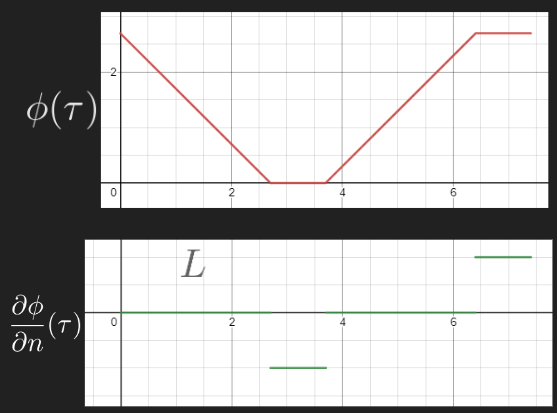

# Potential Flow and the Boundary Element Method

## Fluid and the Free Surface

In this potential flow model, fluid velocity is specified by a potential
$\phi$ throughout a domain $\Omega$. The velocity is taken to be $\nabla \phi$, which when assumed to be incompressible, forces $\phi$ to be harmonic:

$$\nabla^2 \phi = \nabla\cdot(\nabla\phi) = 0$$

Note that the potential flow assumption eliminates vorticity $(\nabla\times (\nabla\phi) = 0)$. To describe the motion of water in a nontrival fashion, a free surface is necessary. In reality, the free surface is a boundary layer between the air and water, but the BEM does not assume the existence of anything outside of the boundary. To approximate an air-water interface, the following equation of motion is used, relating to the Bernoulli equation for unsteady flow:
$$\frac{\partial \phi}{\partial t} + \frac{|\nabla \phi|^2}{2} + gz + \frac{p}{\rho} = 0$$
where $g$ is the constant for gravitational acceleration, $z$ is the vertical coordinate (negative direction of gravitational acceleration), $p$ is static pressure, and $\rho$ is fluid density. At the air-water interface, $p$ does not vary much, and can be assumed to be a constant atmospheric pressure unless otherwise specified. Thus, we can assume $p = 0$. Since the free surface changes over time, we may want to write this in a Lagrangian formulation:

$$\frac{D\vec x}{Dt} = \nabla \phi$$
$$\frac{D\phi}{Dt} = \frac{\partial \phi}{\partial t} + \nabla\phi\cdot\nabla\phi
= \frac{|\nabla \phi|^2}{2} - gz - \frac{p}{\rho}$$

If we are able to find $\nabla \phi$ on the free surface, we have enough information to time-integrate its motion. Finite differences can be used to obtain the directional derivative tangent to the boundary. The directional derivative in the normal direction can be found using a Boundary Element Method approach.

## The Boundary Integral

Using Green's third identity, it suffices to know $\phi$ on the boundary $\Gamma = \partial \Omega$, since for any $\vec x_l$, including inside $\Omega$,

$$\alpha(\vec x_l)\phi(\vec x_l) = \int_{\Gamma} \frac{\partial\phi}{\partial n}(\vec x)\;G(\vec x,\vec x_l) - \phi(\vec x)\; \frac{\partial G}{\partial n}(\vec x,\vec x_l) ~d\Gamma$$

where $\alpha(\vec x_l)$ is a geometric coefficient describing how "inside $\Omega$" $\vec x_l$ is, and $G$ is the Green's function $(\nabla^2 G(\vec x,\vec x_l) = \delta(\vec x-\vec x_l))$. For our 2d model, we have
$$G(\vec x,\vec x_l) = -\frac{1}{2\pi} \ln |\vec x - \vec x_l|$$
$$\frac{\partial G}{\partial n}(\vec x,\vec x_l) = -\frac{1}{2\pi}\;
\frac{(\vec x - \vec x_l)\cdot n}{|\vec x - \vec x_l|^2}$$

$\alpha$ takes a value of zero outside $\Omega$ and 1 inside, but on the boundary, $\alpha$ is equal to the angle of the interior $\Omega$. That is, if
$\gamma(t)$ parameterizes a part of the boundary with $\gamma(0) = x_l$ and
$v_1 = \lim_{t\to 0^-}\gamma'(t), v_2 = \lim_{t\to 0^+}\gamma'(t)$, then the angle between $v_2$ and $-v_1$ will be $2\pi\alpha(x_l)$. For example, if
$\gamma$ is $C^1~(v_1 = v_2)$, then $\alpha(x_l) = \frac12$.

Set $\Gamma = \Gamma_n \cup \Gamma_d$, where a Dirichlet boundary condition is specified on $\Gamma_d$ and a Neumann boundary condition is specified on $\Gamma_n$. One can use PDE theory to discuss the well posedness of the boundary value problem for the Laplace equation:

$$\left\{\begin{array}{ll}
\nabla^2 \phi = 0& \text{on }\Omega\\
\phi = u& \text{on }\Gamma_d\\
\frac{\partial\phi}{\partial n} = q& \text{on }\Gamma_n\\
\end{array}\right.$$

for given functions $u,q$, but we will assume that the problem is well posed. We skip the discussion of Robin boundary conditions, since those are not supported in this code. Solid boundaries, like walls, are represented using Neumann boundary conditions, since no inflow/outflow is specified by $\frac{\partial\phi}{\partial n} = 0$. The free surface, that is the water line, is represented using a Dirichlet boundary condition, where $\phi$ is given by a known analytical solution, or by advecting the velocity potential from a prior state in the simulation.
<!---
TODO: link to advection, mention/link other boundary types.
--->

<!---
$$\alpha(\vec x_l)\phi(\vec x_l) + \int_{\Gamma_n} \phi(\vec x)\; \frac{\partial G}{\partial n}(\vec x,\vec x_l) ~d\Gamma -\int_{\Gamma_d} \frac{\partial\phi}{\partial n}(\vec x)\;G(\vec x,\vec x_l)~d\Gamma = \int_{\Gamma_n} \frac{\partial\phi}{\partial n}(\vec x)\;G(\vec x,\vec x_l)~d\Gamma -\int_{\Gamma_n}  \phi(\vec x)\; \frac{\partial G}{\partial n}(\vec x,\vec x_l) ~d\Gamma$$
--->

### Discretization

The boundary is discretized by a finite set of nodes $X$, which determine both the shape of the boundary and the interpolation of the functions $\phi$ and $\frac{\partial \phi}{\partial n}$, when restricted onto the boundary.
When describing functions along the boundary, we want to operate in a finite dimensional vector space $V\subseteq L^2(\Gamma)$. This is because, if we have a basis $\{N_1,\dots,N_J\}$, then we can split up the integral

$$\alpha(\vec x_l)\phi(\vec x_l)= \alpha(\vec x_l)\sum_{j=1}^J u_j N_j(\vec x_l) = \sum_{j=1}^J q_jK_{d;j,l} - \sum_{j=1}^J u_jK_{n;j,l}$$
$$K_{d;j,l} = \int_{\Gamma} N_j(\vec x) G(\vec x,\vec x_l)~d\Gamma$$
$$K_{n;j,l} = \int_{\Gamma} N_j(\vec x) \frac{\partial G}{\partial n}(\vec x,\vec x_l)~d\Gamma$$

where $\frac{\partial\phi}{\partial n} = \sum_{j=1}^J q_jN_j$ and $\phi = \sum_{j=1}^J u_jN_j$. This motivates the construction of a linear system of equations that we can solve to find the solution to the equation. There are some restrictions we can place on $X$ and the basis to facilitate an easy solver.

- **Corners are Nodes** - If $\Gamma$ has a corner, or a sharp turn, a node should be placed there, and at least one basis function should be discontinuous at that node. This is important for describing $\Gamma$ through interpolation. Moreover, if the domain has a sharp turn, one can expect $\frac{\partial\phi}{\partial n}$ to be discontinuous. We want to be able to properly represent such solutions.
- **Kronecker Delta and Nodal Coincidence** - We want each $N_j$ to be zero at all but one node $\vec x\in X$. This simplifies the left hand side of the equation from $\alpha(\vec x_l)\phi(\vec x_l)$ to $u_k$ for some $k$. In general, evaluating $\phi$ from the $u_j$ is easier.
It might make sense to index our basis by the set $X$, but we need to consider corners.  To deal with this, we ascribe two basis functions to each corner, which localize either side. We call the corner node a [double node](#double-nodes). Every other node has a single basis function that is nonzero there, so $|X| + C = J$, where $C$ is the number of corners.
- **Localized Basis** - If the $N_j$ are chosen so that they are nonzero for only a small part of the domain, computing integrals becomes an $O(J^2)$ operation (one for each $j,l$ pair). Since the domain $\Gamma$ needs to be broken up into smaller integrals, the computational complexity increases. The natural choice is to break up the integral into segments broken up by the nodes $X$, which would increase the complexity to $O(J^3)$.
- **Contains Constant Function** - While not immediately obvious, it is helpful for the constant function $\phi \equiv 1$ to be in the basis. Under the Kronecker Delta restriction, this is $u_j = 1, q_j = 0$ for every $j$ (though, we might need special consideration for the double nodes, dependent on how they are handled). This allows for us to easily calculate the geometric parameter $\alpha(\vec x_l) = -\sum_{j=1}^J K_{n;j,l}$. [Grilli et al (1989)](#ref_gss) mentions how calculating $\alpha$ this way is more stable. One way of thinking about it is that using a geometric definition may provide a different estimate of $\alpha$ in the continuous solution when compared to the boundary integral's estimate, and we want to keep our estimates consistent.

Among the $2J$ variables $u_1,\dots,u_J,q_1,\dots,q_J$, half of them are known, since they are provided within the boundary conditions. Hence, we need to construct a system of $J$ equations.
Put together, we have one equation for each $\vec x_l \in X$ based on the boundary integral
$$\alpha(\vec x_l)u_{k} = \sum_{j=1}^J q_jK_{d;j,l} - \sum_{j=1}^J u_jK_{n;j,l}$$

#### Corner Continuity Equations
The last $C$ equations can come from continuity. At corners, we want both $\phi$ and $\nabla\phi$ to be continuous. We can obtain an equation for each corner by enforcing one of these continuities:

- If $u$ is unknown on either side of the corner (one side has a Neumann boundary condition), we can enforce continuity of $u$. Say $j_1,j_2$ are the indices corresponding to the corner. We force $u_{j_1} = u_{j_2}$.
<!---Consideration of L^2, and how there might be a discontinuity at x_l, but that doesn't matter--->

- If $u$ is known on both sides (both sides are Dirichlet-type), then $u_{j_1} = u_{j_2}$ does not provide any more information (amounts to $0=0$). In this case, we want to relate the derivatives. Using a finite differencing scheme, one can estimate $\phi_s = \frac{\partial \phi}{\partial s}$, the along-curve directional derivative on either side of the corner. Since $\phi_n = \frac{\partial \phi}{\partial n}$ is the perpendicular direction, we can equate $\nabla \phi$ on either side of the corner, which should be continuous. Since $\phi_n$ is the unknown (on both sides), this will generate a system of two equations with two unknowns, using trigonomety. We only need to use one of them.

#### Example - Uniform Flow

For an example, consider a uniform flow in a pipe. The top and bottom have a free-slip (since potential flow is irrotational and nonviscous) condition, and the inflow/outflow are specified by potentials. The diagram below parameterizes $\Gamma$ by $\tau$.

You can verify that the solution is $\phi = \frac{b}{L}x$ $(\nabla \phi = (\frac{b}{L},0))$. For a discrete solution, we can use a simple linear interpolation and an even spacing of nodes along each edge as seen below. Let the top right corner node be node 1, and increase counterclockwise.

The simplest choice of basis is linear. In the image below, the blue regions represent the Neumann boundary. Green lines mark where the nodes are in this parameterization. Notice how this choice satisfies the restrictions mentioned earlier.

This example has $J = 20$ and $|X| = 16$. If we index from bottom to top,
boundary conditions force $q_1=\dots = q_{12} = 0$, $u_{13} = \dots = u_{16} = 0$, and $u_{17} = \dots = u_{20} = b$. In order to relate the basis functions to node indices, write $\verb+indX+(j)$ to denote $l$ where $N_j(\vec x_l) = 1$. Then,

|$j$|1|2|3|4|5|6|7|8|9|10|
|----|----|----|----|----|----|----|----|----|----|----|
|$\verb+indX+(j)$|1|2|3|4|5|6|9|10|11|12|

|$j$|11|12|13|14|15|16|17|18|19|20|
|----|----|----|----|----|----|----|----|----|----|----|
|$l$|13|14|6|7|8|9|14|15|16|1|

We want a (right) inverse to $\verb+indX+$, which will help us include the $\alpha(\vec x_l)\phi(\vec x_l)$ term into the equation. This amounts to making a choice for each corner between the two values of $j$ with the same $\verb+indX+(j)$. Once we lock in our choices, we can define $\verb+indX+^{-1}$ accordingly, so that $\verb+indX+(\verb+indX+^{-1}(l)) = l$, and
$\alpha(\vec x_l)\phi(\vec x_l) = \alpha(\vec x_l)u_{\verb+indX+^{-1}(l)}$

 To solve for the 20 unknown variables, we obtain 16 equations from the boundary integral: one for each element of $X$:
$$\alpha(\vec x_l)u_{\verb+indX+^{-1}(l)} + \sum_{j=1}^{12} u_j(K_{n;j,l}) - \sum_{j=13}^{20} q_jK_{d;j,l} = \sum_{j=1}^{12} q_jK_{d;j,l} - \sum_{j=13}^{20} u_jK_{n;j,l},~~~l=1,\dots,16$$
Except for the first term, all of the knowns are on the right, and all of the unknowns are on the left. $u_{\verb+indX+^{-1}(l)}$ may be known or unknown dependent on the choice. The last 4 equations to form a complete system come from corner compatibilities. The solution, in terms of the boundary is

### Double-Nodes

At a corner, $\frac{\partial\phi}{\partial n}$ will be discontinuous. In order to properly model the discontinuity in the discrete solution, we need some basis functions that are discontinuous there. A good way to deal with this while satisfying the restrictions stated in the [discretization section](#discretization) is to separate the boundary into segments where each basis function is nonzero only on one segment. These segments are separated by corner nodes. By doing this, each segment has its own basis, and the basis for the full boundary can be taken as the union of each segment basis, where a value of zero is taken outside the original segment.

This project uses this strategy. Each [boundary segment](boundary.md) has its own logic. Relevant to the BEM, the entire segment is either Neumann or Dirichlet, and has its own set of nodes and discretization method.
<!---Elaborate, link to this!!--->

It should be noted that this strategy may not appear to have a well defined corner definition. Taking from the [uniform pipe flow example](#example---uniform-flow), both functions $N_6$ and $N_{13}$ are 1 at node 6, the corner node at the top left. If a function looked like
$f = aN_6 + bN_{13}$, it would seem like it approaches $a$ from the top side, and $b$ from the left side, but takes the value $a+b$ at the corner. This doesn't really matter, as the BEM is an integral problem, so single-point discontinuities do not affect the problem. In a more rigorous sense, instead of looking at functions, we are looking at equivalence classes of functions, where two functions are considered "the same" if integrals treat them the same:
$$\|f_1 - f_2\|_{L^2} := \sqrt{\int (f_1-f_2)^2~dx} = 0$$
For our purposes, the important value is the limit as we approach the corner, not what the exact value at the corner is. In this way, $f = a N_6 + b N_{13}$ describes a function that is zero at every node except node 6, where, from the top side, $f$ approaches $a$, and from the left side, $f$ approaches $b$. This allows us to elaborate a bit more on the [corner equations](#corner-continuity-equations).
- If $\phi = f$, then we would consider $\phi$ continuous when we enforce $a=b$.
- If $\frac{\partial\phi}{\partial n} = f$, then we can equate $f$ with $\pm\frac{\partial\phi}{\partial s}$, depending on directions. To elaborate, consider these functions in terms of their parameter. That is, $\lim_{\tau \to L^-}f(\tau) = a$ and $\lim_{\tau \to L^+}f(\tau) = b$. If we assume outward facing normals, then $a = -\lim_{\tau\to L^+}\frac{\partial\phi}{\partial s}$, since both sides refer to the directional derivative in the upward direction. Similarly, $b = \lim_{\tau \to L^-}\frac{\partial\phi}{\partial s}$, since both are leftward facing directional derivatives. If the angle at this corner was not perpendicular, then trigonometry would be used. Ultimately, since $b$ is the unknown value in the problem, we would use the second equation.

### Solving the Integrals $K_d$ and $K_n$

For simple functions (linear), explicit analytical solutions appear to exist, however, this project does not use them ast of now.
If these integrals occur far away from the singularity $\vec x_l$, a simple quadrature scheme will work. When close to a singularity, an adaptive scheme may be necessary. From how the discretization is handled, there will be cases where $\vec x_l$ appears on the boundary being integrated, for which the shape/basis function $N_j$ is nonzero. Below, we discuss strategies for dealing with the singularity.

The value $K_{d;j,l}$ is the integral

$$
K_{d;j,l} = \int_{\Gamma} N_j(\vec x)G(\vec x,\vec x_l) ~ d\Gamma
$$

We can use a technique to increase the accuracy of the quadrature, detailed in [Otta, Svendsen, and Grilli (1992)](#ref_osg).
Let $r(t)$ be the parameterization of a segment with a singularity, defined on $0 \le t \le 1$. If $r(t_l) = \vec x_l$, then we can rewrite the integral as

$$
\int_0^1 N_j(r(t))G(r(t),r(t_l)) ~ d\Gamma
= -\frac{1}{2\pi}\int_0^1 N_j(r(t))\left(\ln\frac{|r(t)-r(t_l)|}{|t-t_l|} + \ln|t - t_l|\right) ~ d\Gamma
$$
$$
= -\frac{1}{2\pi}\left[\int_0^1 N_j(r(t))\ln\frac{|r(t)-r(t_l)|}{|t-t_l|}~d\Gamma + \int_0^1 N_j(r(t))\ln|t - t_l| ~ d\Gamma\right]
$$

where the first integral has no singularity because $r$ is differentiable and the second is solved using a special Gaussian quadrature in [Anderson (1964)](#ref_specialquad).

The value $K_{n;j,l}$ is the integral

$$
K_{n;j,l} = \int_{\Gamma} N_j(\vec x)G_n(\vec x,\vec x_l) ~ d\Gamma
$$

Similar to the $K_{d;j,l}$, we use a technique to increase the accuracy of the quadrature, detailed in [Otta, Svendsen, and Grilli (1992)](#ref_osg).
As before, let $r(t) = (x(t),z(t))$ be the parameterization of a segment $\gamma$ with a singularity, with $0 \le t \le 1$, and set $r(t_l) = \vec x_l$.
Notice $\nabla \tan^{-1}(y/x) = -\nabla \tan^{-1}(x/y) = \frac{(-y,x)}{x^2+y^2}$, so that

$$
\frac{\partial}{\partial t} \tan^{-1}\left(\frac{z(t) - z(t_l)}{x(t) - x(t_l)}\right) = 
\frac{\partial}{\partial t} -\tan^{-1}\left(\frac{x(t) - x(t_l)}{z(t) - z(t_l)}\right)$$

$$= \frac{(z(t_l)-z(t), x(t) - x(t_l))}{|r(t) - r(t_l)|^2} \cdot \frac{d r}{d t}
= \frac{ \frac{dz}{dt}(x(t) - x(t_l)) ~ - ~ \frac{dx}{dt}(z(t)-z(t_l))}{|r(t) - r(t_l)|^2}
$$

Because $d\Gamma = |r'(t)|dt$, we notice $G_n(\vec x,\vec x_l) ~ d\Gamma$ evaluates to the same quantity (with a factor of $-1/{2\pi}$). Thus, we can use substitution to obtain

$$-
\frac{1}{2\pi}\int_{0}^1 N_j(r(t))\frac{dv}{dt} ~ dt, ~ ~ ~ ~ v = \tan^{-1}\left(\frac{z(t) - z(t_l)}{x(t) - x(t_l)}\right) \text{ or } v=-\tan^{-1}\left(\frac{x(t) - x(t_l)}{z(t) - z(t_l)}\right)
$$

where the choice of $v$ depends on the alignment of the curve. If the boundary is mostly horizontal, it would make sense to use the first definition, while vertical alignment would incentivize the second definition in order to keep the fraction away from infinity.

After integration by parts, the integral becomes

$$
-\frac{1}{2\pi}\int_{0}^1 N_j(r(t))\frac{dv}{dt} ~ dt = -\frac{1}{2\pi}\left[N_j(r(1)v(1) - N_j(r(0))v(0) - \int_{0}^1 v(t)N_j(r(t)) ~ dt\right]
$$
which has no singularities. For $t \approx t_l$, refer to the first derivative when sampling $v$.

## References

<a id="ref_specialquad">[1]</a> *Anderson, D.* Gaussian Quadrature Formulae for $\int_0^1 -\ln(x)f(x) dx$. Mathematics of Computation 19 (1965), 477-481

<!---https://doi.org/10.1090/S0025-5718-1965-0178569-1--->

<a id="ref_gss">[2]</a> *Grilli, S., Skourup, J., and Svendsen, I.* An efficient boundary element method for nonlinear water waves. Engineering Analysis with Boundary Elements, 1989, Vol. 6, No 2, 97-107

<a id="ref_osg">[3]</a> *Otta, A., Svendsen, I., Grilli, S.* Unsteady Free Surface Waves in a Region of Arbitrary Shape
Center for Applied Coastal Research, University of Delaware, Report No. CACR-92-10