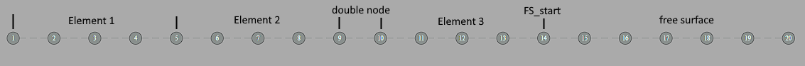

bem_sim
=======
Kentaro Hanson
:stem:

This class contains the variables needed to run a BEM free-surface simulation.

== Properties

* <<boundary,+*boundary*+>>
    - Stores the necessary information to represent the boundary elements:
        ** <<boundary_N,+*N*+>> - The number of nodes in the boundary
        ** <<boundary_x,+*x*+>> - Array of length +N+ that represents the __x__ values of each node
        ** <<boundary_x,+*z*+>> - Array of length +N+ that represents the __z__ values of each node
        ** <<boundary_doublenode,+*doublenode*+>> - Array of logical values (0 or 1) that represent whether or not the corresponding node is a link:bem_method.html[double node].
        ** <<boundary_fsstartend,+*FS_start*+>> - Index of the first free surface node
        ** <<boundary_fsstartend,+*FS_end*+>> - Index of the last free surface node
        ** <<boundary_phiFS,+*phi_FS*+>> - Velocity potential stem:[\phi] on the free surface

* <<interpolation,+*interpolation, interpolation_FS, interpolation_sliding*+>>
    - Stores values for Lagrange interpolation. Currently only `M=1` is used on the full boundary and `M=4` is used on the sliding segment.
        ** <<interpolation_M,+*M*+>> - The order of the Lagrange interpolation (order of the polynomial); `M+1` nodes are used.
        ** <<interpolation_lagrange,+*Lagrange*+>> - Coefficients of the Lagrange polynomials
        ** <<interpolation_lagrangep,+*Lagrange_prime*+>> - Coefficients of the derivatives of the Lagrange polynomials
        ** <<interpolation_lagrangepp,+*Lagrange_primeprime*+>> - Coefficients of the second derivatives of the Lagrange polynomials

* <<stepping,+*stepping*+>>
    - Stores information relevant to time-stepping the simulation
        ** <<stepping_t,+*t*+>> - The current time of the simulation
        ** <<stepping_dt,+*dt*+>> - The time step of the simulation
        ** <<stepping_store_dt,+*store_dt*+>> - Time interval between saving data to `history`
        ** <<stepping_courant_number,+*courant_number*+>> - The Courant number of the simulation
        ** <<stepping_courant_lock,+*courant_lock*+>> - Whether to lock the Courant number or `dt` when stepping
        ** <<stepping_timestep_method,+*timestep_method*+>> - The integration scheme for time stepping
* <<history,+*history*+>>
    - Stores prior states of the simulation
        ** <<history_time,+*time*+>> - Times for each data point in history
        ** <<history_energy,+*energy*+>> - Calculated energy for each index in +time+
        ** <<history_energy,+*KE*+>> - Calculated kinetic energy for each index in +time+
        ** <<history_energy,+*PE*+>> - Calculated potential energy for each index in +time+
        ** <<history_volume,+*volume*+>> - Calculated volume for each index in +time+
        ** <<history_x_FS,+*x_FS*+,+*x_full*+>> - Calculated free surface or full boundary node `x` locations for each index in +time+
        ** <<history_x_FS,+*z_FS*+,+*z_full*+>> - Calculated free surface or full boundary node `z` locations for each index in +time+
        ** <<history_phi_FS,+*phi_FS*+>> - Calculated free surface velocity potential stem:[\phi] for each index in +time+
        ** <<history_net_flux,+*net_flux*+>> - Calculated integral of flux stem:[\int_{\Gamma} \phi_n  d\Gamma] for each index in +time+
        ** <<history_mean_water_level,+*mean_water_level*+>> - Calculated mean of stem:[\eta] for each index in +time+
        ** <<history_condition_number,+*condition_number*+>> - Calculated condition number of the algebraic system for each index in +time+
* <<meta,+*meta*+>>
    - Stores metadata about the simulation. More values than the following may exist, but these ones exist for all simulations.
        ** <<meta_a0,+*has_a0*+>> - Flag for whether or not to use an `a0` value in the simulation. This affects plotting.
        ** <<meta_plot_ylim,+*plot_ylim*+>> - If plotting is done, these are the `ylim` parameters
        ** <<meta_plot_ylim,+*plot_xlim*+>> - If plotting is done, these are the `xlim` parameters
        ** <<meta_sim_parallel_workers,+*sim_parallel_workers*+>> - Number of worker threads during intensive computation
        ** <<meta_g,+*g*+>> - Acceleration due to gravity
        ** <<meta_L,+*L*+>> - Length of the simulation (x-distance)
        ** <<meta_wall_resolution_factor,+*wall_resolution_factor*+>> - approximate ratio of node spacing on the wall relative to the bottom boundary and free surface
        ** <<meta_history_store_full_boundary,+*history_store_full_boundary*+>> - Whether or not the full boundary should be stored in history
        ** <<meta_history_store_angle_FS,+*history_store_angle_FS*+>> - Whether or not the angle of the free surface should be stored in history
        ** <<meta_integral_spline,+*integral_spline*+>> - Whether or not to use a spline for the boundary integral
* <<characteristics_,+*characteristics_*+>>
    - Stores values that may represent intermediate steps- nothing in this struct should be modified.
* <<regridding,+*regridding*+>>
    - Stores parameters for the regridding scheme, used in <<method_handle_regrid,+*handle_regrid()*+>>.
        ** <<regridding_regrid_type,+*regrid_type*+>> - How the nodes are regridded
        ** <<regridding_threshold_type,+*threshold_type*+>> - When the nodes are regridded
        ** <<regridding_did_regrid,+*did_regrid*+>> - If the nodes were regridded this step

[#boundary]
=== bem_sim.boundary

`boundary` is a structure that represents the boundary elements of the simulation, which is discretized into `N` nodes.

For nodes on the free surface,
`FS_start <= j <= FS_end`, the nodes are interpolated using a quasi-spline scheme, where the geometry is interpolated by a cubic spline, and the values on the surface are interpolated linearly.

On elements outside of the free surface, isoparametric elements of size `M` are used, stored in <<interpolation_M,`interpolation.M`>>. Because of this, `FS_start`, `FS_end`, and `N` must take values that allow non-free-surface elements to be represented by consecutive, non-overlapping nodes. Specifically, regions between double nodes must consist of `kM + 1` nodes for some positive integer `k`.

[#boundary_N]
===== N - [small]#integer#
`N` represents number of nodes in the boundary, including double nodes. This dictates the length of +x+, +z+, and +doublenode+.

[#boundary_x]
===== x, z - [small]#float array#
`x` and `z` are both arrays of length `N` that store the __x__ and __z__ coordinates of each node, respectively. On indices `j` where `doublenode(j) = 1`, we must have `x(j) = x(j+1)` and `z(j) = z(j+1)`.

[#boundary_doublenode]
===== doublenode - [small]#logic array#
`doublenode` is an `N`-length array of logical values (0 or 1) that represent whether or not the corresponding node is a link:bem_method.html#doublenode[double node]. On indices `j` where `doublenode(j) = 1`, the `j`^th^ and `j+1`^th^ nodes must have the same position. That is, `x(j) = x(j+1)` and `z(j) = z(j+1)`.

[#boundary_fsstartend]
===== FS_start, FS_end - [small]#integer#
`FS_start` and `FS_end` represent the node indices which determine the free surface nodes.

[#boundary_phiFS]
===== phi_FS - [small]#float array#
`phi_FS` is an array of length `FS_end - FS_start + 1` that store the velocity potential stem:[\phi] along the free surface, where stem:[\phi] at node `FS_start <= j <= FS_end` is represented by `phi_FS(j - FS_start + 1)`.

[#interpolation]
=== bem_sim.interpolation

`interpolation`, `interpolation_FS`, and `interpolation_sliding` are structures that store the order of the Lagrange interpolation and the polynomial coefficients for such an interpolation. These structures share the format with link:functions.html#get_interpolation_struct[`get_interpolation_struct()`], which is used to populate these fields.

`interpolation` specifies the order of the isoparametric elements on the non-free-surface boundary, while `interpolation_FS` determines the shape function of the sliding element on the free surface in the boundary integral calculation.
`interpolation_sliding` determines the sliding element used for surface derivative calculation, used in the time-stepping procedure, link:functions.html#step_sim[`step_sim()`].

It is preferred for `interpolation_FS.M` to be odd so that an even number of collocation points are used so that the middle is a segment that the sliding element is based on, and `interpolation_sliding.M` to be even so that there is a center node for the derivatives to be calculated at.

The values stored here are used both in link:functions.html#eval_Kn_Kd[+eval_Kn_Kd()+] and link:functions.html#step_sim[+step_sim()+], when interpolating values on the boundary. On the free surface, `step_sim()` uses a sliding element of `interpolation.M+1` nodes to evaluate derivatives, while everywhere else is evaluated isoparametrically with an element of `interpolation.M+1` nodes. `step_sim()` uses `interpolation.M` instead of `interpolation_FS.M` because an odd number of collocation points is desirable. Specifically, `step_sim()` uses values at a node instead of a segment, so it is preferrable to operate on an element that has a node in the center.

In +eval_Kn_Kd()+, the free surface is interpolated using a sliding element of  order `interpolation_FS.M`. The integrals between two nodes `k` and `k+1` are calculated on the middle segment, except close to the ends of the free surface, where the element would extend past the free surface if centered on the `k`,`k+1` segment.

[#interpolation_M]
===== M - [small]#integer#
`M` represents the order of the Lagrange interpolation. `M+1` nodes are used, resulting in Lagrange polynomials of degree `M`.

[#interpolation_lagrange]
===== Lagrange - [small]#float matrix#
`Lagrange` stores the coefficients of the Lagrange polynomials. For `M=4`, this is a stem:[5\times 5] matrix. For general `M` the matrix is stem:[(a_{i,j})] where

[stem]
====
\[
    L_i(x) = \sum_{j=1}^{M+1} a_{i,j} x^{j-1} = \prod_{\begin{matrix}k=1\\k\ne i\end{matrix}}^{M+1} \frac{x - x_k}{x_i - x_k}
\]
====
is the Lagrange polynomial for node stem:[i]. For `interpolation.Lagrange` and `interpolation_sliding.Lagrange`, the interval stem:[\[0,1\]] is used, with stem:[x_k = \frac{k}{M+1}]. For `interpolation_FS.Lagrange`, the interval stem:[\[0,M\]] is used, with stem:[x_k = k].

[#interpolation_lagrangep]
===== Lagrange_prime - [small]#float matrix#
`Lagrange_prime` stores the coefficients of the derivatives of the Lagrange polynomials. For `M=4`, this is a stem:[5\times 4] matrix. For general `M` the matrix is stem:[(a_{i,j})] where

[stem]
====
\[
    L_i'(x) = \sum_{j=1}^{M} a_{i,j} x^{j-1}
\]
====
This means that if stem:[(b_{i,j})] is the matrix representing `Lagrange`, we have

[stem]
====
\[
    a_{i,j} = jb_{i,j+1}
\]
====

[#interpolation_lagrangepp]
===== Lagrange_primeprime - [small]#float matrix#
`Lagrange_primeprime` stores the coefficients of the second derivatives of the Lagrange polynomials. For `M=4`, this is a stem:[5\times 3] matrix. For general `M` the matrix is stem:[(a_{i,j})] where

[stem]
====
\[
    L_i''(x) = \sum_{j=1}^{M-1} a_{i,j} x^{j-1}
\]
====
This means that if stem:[(b_{i,j})] is the matrix representing `Lagrange`, we have

[stem]
====
\[
    a_{i,j} =  j(j+1)b_{i,j+2}
\]
====

[#stepping]
=== bem_sim.stepping
`stepping` is a structure that holds information relevant to timestepping, which is handled by the <<method_step,`step()`>> method.

[#stepping_t]
===== t - [small]#float#
`t` represents the current time of the simulation. This is updated every time the simulation is stepped.

[#stepping_dt]
===== dt - [small]#float#
`dt` represents the size of the time step. Every step increments `t` by `dt`. This value should be allowed to be modified inside and outside of the stepping code in order to support adaptive schemes.

[#stepping_store_dt]
===== store_dt - [small]#float#
`store_dt` represents the time interval between writing values of the simulation into <<history,`history`>>. If this value is less than or equal to `dt`, then every frame, a history update occurs.

Every step, the last recorded time in `history` is compared to `stepping.t`. If the difference is greater than `store_dt`, a <<method_update_history,history update call>> is made.

[#stepping_courant_number]
===== courant_number - [small]#positive float#
`courant_number` represents the Courant number stem:[u \frac{\Delta x}{\Delta t}], which is calculated in link:functions.html#step_sim[`step_sim()`]. Hence, this value is set to the Courant number at the previous time step. stem:[\Delta t] is taken to be the time step size `dt`, stem:[\Delta x] is taken to be the minimum distance between two adjacent nodes, and stem:[u] is taken to be the maximum velocity stem:[\|\nabla\phi\|] on the free surface. This choice was made to keep nodes from colliding with each other, and may not perform well to maintain overall stability, in certain standing wave scenarios, for example.

[#stepping_courant_lock]
===== courant_lock - [small]#logical#
Each time step, the step size taken is determined by keeping either `dt` constant or `courant_number` constant. When `courant_lock` is true, `courant_number` is kept constant, so `dt` is set in order for that to be true. Otherwise, `dt` is kept constant, and `courant_number` is simply updated for the current time step.

[#stepping_timestep_method]
===== timestep_method - [small]#string#
`timestep_method` represents the integration scheme used for time stepping. This may be a string of one of the following values:

.Time-stepping Methods
|===
|value | Description
|\'taylor2'
|Use a second order Taylor series method +
stem:[u_{j+1} = u_j + hf(u_j) + \frac{h}{2}f'(u_j)]
|\'abm4'
|Use a 4th order Adams-Bashforth method +
stem:[u_{j+1} = u_j+h/24\left(55f(u_j)-59f(u_{j-1}) + 37f(u_{j-2}) - 9f(u_{j-3})\right)] +
initiated by \'taylor2'.
|\'abm2'
|Use a 2nd order Adams-Bashforth method +
stem:[u_{j+1} = u_j+h/2\left(3f(u_j)-f(u_{j-1})\right)] +
initiated by \'taylor2'.
|\'euler'
|Use Euler's method +
stem:[u_{j+1} = u_j+hf(u_j)] +
|===

[#history]
=== bem_sim.history

`history` is a structure that stores information of prior time steps in the simulation. In the case of a static boundary, the information here is enough to recreate the simulation at a stored time step `time(i)` using `x_FS(i,:)`, `z_FS(i,:)`, and `phi_FS(i,:)`, but there is currently no support for doing this automatically, yet. Other fields hold data that may be relevant to measuring the link:bem_method.html#accuracy_checks[accuracy of the simulation]. This structure is updated using the <<method_update_history,`bem_sim.update_history()`>> method.

This struct was created prior to netcdf saving, which is now the prefered way of storing history.

[#history_time]
===== time - [small]#float array#
`time` represents the time corresponding to each index in the history. For example, the volume `volume(i)` is the calculated volume at time `time(i)`.

[#history_energy]
===== energy, KE, PE - [small]#float array#
`energy` represents the calculated energy (see link:bem_method.html#accuracy_checks[BEM accuracy checks]) at a given time step.
This is the sum of `KE` and `PE`.

[#history_volume]
===== volume - [small]#float array#
`volume` represents the calculated volume (see link:bem_method.html#accuracy_checks[BEM accuracy checks]) at a given time step.

[#history_x_FS]
===== (x_FS, z_FS) or (x_full, z_full) - [small]#cell array of float arrays#
`x_FS` and `z_FS` represent the free surface node coordinates respectively at a given time step. `x_FS{i}` is equal to <<boundary_x,+boundary.x+>>(<<boundary_fsstartend,+FS_start:FS_end+>>) when the simulation was at time `time(i)`. This is populated if <<meta_history_store_full_boundary,+*meta.history_sture_full_boundary*+>> is set to false.

Otherwise, `x_full` and `z_full` are populated, representing the full boundary node coordinates at a given time step. `z_FS{i}` is equal to <<boundary_x,+boundary.x+>> when the simulation was at time `time(i)`.

[#history_phi_FS]
===== phi_FS - [small]#cell array of float arrays#
`phi_FS` represents the free surface velocity potential at a given time step. `phi_FS{i}` is equal to <<boundary_phiFS,+boundary.phi_FS+>> when the simulation was at time `time(i)`.

[#history_beta_FS]
===== beta_FS - [small]#cell array of float arrays#
`beta_FS` represents the free surface angles at a given time step. `beta_FS{i}` is, at time `time(i)`, calculated using the sliding element at each node, where the derivatives in stem:[x] and stem:[z] are taken and plugged into `atan2()`.

[#history_net_flux]
===== net_flux - [small]#float array#
`net_flux` represents the calculated integral
[stem]
====
\[\int_{\Gamma} \phi_n ~ d\Gamma\] 
====
(see link:bem_method.html#accuracy_checks[BEM accuracy checks]) at a given time step.

[#history_mean_water_level]
===== mean_water_level - [small]#float array#
`mean_water_level` represents the calculated mean of stem:[\eta] as
[stem]
====
\[\int_{\Gamma_{FS}} z ~ dx\]
====
(see link:bem_method.html#accuracy_checks[BEM accuracy checks]) at a given time step.

[#history_condition_number]
===== condition_number - [small]#float array#
`condition_number` represents the condition number of the matrix stem:[A]
(see link:bem_method.html#system_of_equations[BEM System of Equations]) at a given time step. This gives a general idea of how well conditioned the system is, which may not be as helpful in determining accuracy as the other metrics above.

[#meta]
=== bem_sim.meta
`meta` is a structure that stores metadata of the simulation, which may give information about the simulation or how to plot it.

[#meta_a0]
===== has_a0 - [small]#flag (logical)#
`has_a0` tells the simulation whether or not there is an `a0` value attributed
to the simulation. `a0` is also stored in `bem_sim.meta` and may exist even if
`has_a0` is false, in which case it does not have a meaningful value and should be ignored.

`a0` takes the value of a single float and represents the amplitude or wave height of an initial condition. This value is used in graphing, and when `has_a0`
is true, the method <<method_plot_FS,+bem_sim.plot_FS()+>> plots the nondimensional quantity stem:[\frac{\eta}{a_0}] on the y-axis.

[#plot_ylim]
===== plot_ylim, plot_xlim - [small]#float array#
`plot_ylim` and `plot_xlim` respectively represent the `ylim` and `xlim` parameters used for plotting. The default value for `plot_ylim` is stem:[\[-1.5,1.5\]]. The default value for `plot_xlim` is stem:[\[x_0 -\frac{x_1-x_0}{20},x_1 + \frac{x_1-x_0}{20} \]], where stem:[x_0] is the smallest x-value on the boundary upon initialization and stem:[x_1] is the largest. Note that `plot_ylim` is taken as is, even when the y-axis is nondimensionalized, so in the case that `has_a0` is true, the y-values in stem:[\[-1.5a_0, 1.5a_0\]] of the free surface are plotted because <<method_plot_FS,+bem_sim.plot_FS()+>> scales the y-axis by a factor of stem:[a_0].

[#meta_sim_parallel_workers]
===== sim_parallel_workers - [small]#positive integer#
`sim_parallel_workers` represents the number of worker threads in parallel for-loops used during intensive tasks, in particular, the integration in link:functions.html#eval_Kn_Kd[+eval_Kn_Kd()+].

[#meta_g]
===== g - [small]#float#
`g` is the gravitational constant for the simulation. By default this is stem:[9.81].

[#meta_L]
===== L - [small]#float#
`L` is the length of the simulation along the x-direction. This is not used directly by the simulation.

[#meta_wall_resolution_factor]
===== wall_resolution_factor - [small]#positive float#
`wall_resolution_factor` references the node spacing difference between the walls and the rest of the boundary. This is used in generation, where the wall nodes are placed so that the node spacing is rougly `wall_resolution_factor` times `dx`, where `dx` is the free surface node spacing.

[#meta_history_store_full_boundary]
===== history_store_full_boundary - [small]#logical#
`history_store_full_boundary` specifies whether or not to store the full boundary in each history snapshot. When true, `history.x_full` and `history.z_full` are populated with the entire boundary. Otherwise, `history.x_FS` and `history.z_FS` are populated with only the free surface nodes. This should not be modified in the middle of a simulation.

This value is used in <<method_rollback,+*rollback()*+>>, which assumes that the non-free surface boundary does not change when `history_store_full_boundary` is set to false. In general, `history_store_full_boundary` should be set to true.

[#meta_history_store_angle_FS]
===== history_store_angle_FS - [small]#logical#
`history_store_angle_FS` specifies whether or not to store the angle of the free surface in each history snapshot. When true, `history.beta` is populated with the calculated angle at each free surface node. The stored values are a result from calling `atan2()` on surface derivatives, so it is possible for this value to have distinct discontinuities jumping between stem:[\pi] and stem:[-\pi]. stem:[\beta] is calculated using the sliding element.

[#meta_integral_spline]
===== integral_spline - [small]#logical#
`integral_spline` determines if the integral on the free surface is done using a sliding isoparametric element or the spline.

[#characteristics_]
=== bem_sim.characteristics_
`characteristics_` is a structure that should be considered weakly _private_.
Values are stored that may represent intermediate steps, so nothing in this struct should be modified.

[#regridding]
=== bem_sim.regridding
`regridding` stores parameters that are used by <<method_handle_regrid,+*handle_regrid()*+>> for automatic regridding.

[#regridding_regrid_type]
===== regrid_type - [small]#string#
`regrid_type` provides the method used for regridding once it is decided that regridding should be done. `regrid_type` takes one of the following values

.regrid_type values
|===
|Value |Description

|`'none'`
| No regridding is performed.

|`'shift_by_curve3d'`
|Uses `curve_renode_3d()` to evenly
distribute by curve length in stem:[(x,z,a\frac{\phi}{u_{max}})]
coordinates, where stem:[a] is specified by
regrid_param{1}, and stem:[u_{max}] is calculated as
the maximum stem:[\sqrt{\phi_s^2 + \phi_n^2}] on the free
surface. The same number of nodes are used, and
regrid_param{2} specifies the interpolation scheme,
which is passed as the interp_scheme argument into
the `curve_3d` functions.

|`'shift_by_curve2d_normu'`
|uses `curve_renode_by_integral()`
using the integrand stem:[\sqrt{1 + (a\frac{\|u\|}{u_{max}})^2}], which
is similar to `shift_by_curve3d`, except
stem:[\|\nabla(\phi)\|^2] is used instead of stem:[\|\phi_s\|^2]. Like
`shift_by_curve3d`, regrid_param{1} specifies stem:[a].
|===

[#regridding_threshold_type]
===== threshold_type - [small]#string#
`threshold_type` provides the method used to determine whether or not the boundary should be regridded on this time step.

.threshold_type values
|===
|Value |Description

|`'manual'`
| regridding is never performed unless force is
set to 1 in the `handle_regrid()` call.

|`'factor_global'`
|regridding is performed when the
metric differs from the desired value of the metric
by a factor of threshold_param{1}. for
shift_by_curve3d, this metric is the segment
length/total length in 3d. The factor must be
greater than 1.

|`'factor_local'`
|regridding is performed when the
metric differs from the metric of adjacent segments
by a factor of threshold_param{1}. for
shift_by_curve3d, this metric is the segment
length/total length in 3d. The factor must be
greater than 1.

|`'factor_global_local'`
|uses both modes 'factor_desired'
and 'factor_neighbors' with factors
threshold_param{1} and threshold_param{2},
respectively.
|===

[#regridding_did_regrid]
===== did_regrid - [small]#logical#
`did_regrid` is a value that is set to true if the boundary was regridded since the last time step.

[#methods]
== Methods

`bem_sim` has the following methods:

[#method_constructor]
=== Constructor: bem_sim()
[source,matlab]
----
obj = bem_sim()
----

Initializes a bem_sim class object. The constructor takes keyword optional arguments, handled by `inputParser`.

.bem_sim() optional arguments
|===
|Argument |Type |Default |Description

|type
|character array - of specific values
|`'standing_wave'`
|Determines the type of simulation, setting the initial condition as necessary. <<method_constructor_type, This table>> shows the values type can take.

|L
|positive float, or `'default'`
|`'default'`
|The length of the simulation in the x-direction. The default value depends on the <<method_constructor_type, type>> of simulation.

|a0
|positive float, or `'default'`
|`'default'`
|The amplitude or height of the initial condition. This can be seen as a nondimensionalizing factor that sets the initial condition to a height of 1. The default value depends on the <<method_constructor_type, type>> of simulation.

|Nx
|positive integer
|100
|Number of nodes along the free surface.

|h
|positive float
|1
|characteristic water depth

|dt
|positive floating point number
|0.01
|The time step size of the simulation. This gets stored in <<stepping_dt,`stepping.dt`>>.

|store_dt
|positive float
|0.25
|The time elapsed between each history store. This gets stored in <<stepping_store_dt,`stepping.store_dt`>>.

|g
|positive float
|9.81
|Acceleration due to gravity This gets stored in <<meta_g,`meta.g`>>.

|parallel_workers
|nonnegative integer
|1
|Number of workers in the thread pool to use. This is given to the value <<meta_sim_parallel_workers,`bem_sim.meta.sim_parallel_workers`>>

|timestep_method
|character array - of specific values
|`'taylor2'`
|Determines the time-stepping integration scheme. This takes values of and gets stored into <<stepping_timestep_method,`stepping.timestep_method`>>.

|wall_resolution_factor
|positive float
|1
|The number of wall nodes are increased (roughly) by this factor. The number of nodes are kept to be 1 mod <<interpolation,`M`>>.

|history_store_full_boundary
|logical value
|1
|Whether or not to store the entire boundary into history instead of just
the free surface.

|history_store_angle_FS
|logical value
|0
|Whether or not to store the angle of the free surface into history.

|x0
|float
|20
|The value for an initial stem:[x] position. This is used in the `soliton_reflect` initial condition to specify the peak of the solitary wave.

|plot_xlim
|array of 2 floats or `'default'`
|`'default'`
|What will be passed into xlim when the boundary gets plotted, using <<method_plot_FS,`obj.plot_FS()`>> or <<method_plot_full,`obj.plot_full()`>>.

|plot_ylim
|array of 2 floats or `'default'`
|`'default'`
|What will be passed into ylim when the boundary gets plotted, using <<method_plot_FS,`obj.plot_FS()`>> or <<method_plot_full,`obj.plot_full()`>>.
|===

[#method_constructor_type]
.type values
|===
|Value |Description |Default `L`|Default `a0`

|`'standing_wave'`
|Start with an initial condition of the cosine standing wave. This is the same condition the link:tests.html#standingwave[standing wave test] uses.
| stem:[10]
| stem:[10^{-4}]

|`'soliton_reflect'`
|Start with a soliton initial condition. This is the same condition the link:tests.html#bouncingsoliton[bouncing solitary wave test] uses.
| stem:[100]
| stem:[0.1]

|`'empty'`
|Leaves the boundary empty to be set after construction.
|
|
|===

[#method_add_free_surface_nodes]
=== bem_sim.add_free_surface_nodes()
[source,matlab]
----
obj2 = obj.add_free_surface_nodes(xi)
----

For regridding, <<method_handle_regrid,handle_regrid()>> should be used instead.

Adds new free surface nodes at the specified parameterization indices, interpolating as necessary.

A node is placed at each value of `xi`. For each `xi(i)` written as stem:[\xi_i], set stem:[k+s = \xi_i] so that stem:[k] is an integer and stem:[0 <= s < 1]. The
node is added in segment stem:[k] of the free surface (between nodes stem:[\text{FS_start}+k] and stem:[\text{FS_start}+k+1]) and offset by stem:[s], which uniformly distributes the node onto the segment by arc
length (stem:[s = 0] corresponds to node stem:[\text{FS_start}+k] and stem:[s = 0.5] corresponds to the midpoint of segment stem:[k]). The arc length is calculated using standard Gauss-Legendre Quadrature.

`tol` can be specified as an optional argument (default stem:[10^{-3}])
and is the allowed deviation stem:[s] from its actual value in node
placement. The bisection method is used, so `tol` specifies
the maximum domain size before termination.

this method updates <<characteristics_,+characteristics_+>> prior to addition and
sets characteristics_.ctime to `'null'` so the next
<<method_update_characteristics,characteristics update>> will automatically call link:functions.html#eval_Kn_Kd[+eval_Kn_Kd()+].

.add_free_surface_nodes arguments
|===
|Argument |Type |Description
|xi
|float array
|List of positions to add nodes to. This should stay between 0 and <<boundary_fsstartend,+FS_end - FS_start+>>, avoiding values close to integers in order to not create quasi-singularities^[cit]^.

|tol
|float (optional)
|Allowed tolerance for arc-length-based positioning. Default is stem:[10^{-3}]
|===

[#method_clear_history]
=== bem_sim.clear_history()
[source,matlab]
----
obj = obj.clear_history();
----

Clears the <<history,history>> struct.

[#method_gen_mat_b]
=== bem_sim.gen_mat_b()
[source,matlab]
----
obj.gen_mat_b(bt, bv);
----

Generates a column vector stem:[b] that can be used along side <<characteristics_,+bem_sim.characteristics_+>>`.mat_A` to solve for a system of the missing values.

.gen_mat_b arguments
|===
|Argument |Type |Description
|bt
|length-<<boundary_N,`N`>> logical array
|For each node, what time of boundary it is. When `bv` specifies a potential quantity stem:[u], `bt` should be set to 0. When `bv` specifies a normal derivative quantity stem:[q], `bt` should be set to 1.

|bv
|length-<<boundary_N,`N`>> float array
|For each node, the given value at that node.
|===

Because `mat_A` is purely a geometric quantity and not dependent on the values `bv`, `mat_A` only needs to be generated once every time step. This method handles generating `mat_b`, so the system can be solved using

[source,matlab]
----
newvals = (obj.characteristics_.mat_A\obj.gen_mat_b(bt, bv))';
u = bt.*newvals + (1-bt).*bv;
q = (1-bt).*newvals + bt.*bv;
----

[#method_handle_regrid]
=== bem_sim.handle_regrid()
[source,matlab]
----
obj = obj.handle_regrid(force);
----

Checks and preforms regridding according to the `regridding` struct of the object.

.handle_regrid arguments
|===
|Argument |Type |Description
|force
|logical
|Whether or not threshold conditions should be ignored. When `force` is true, regridding occurs no matter what. Otherwise, the threshold conditions are used.
|===

[#method_interior_eval]
=== bem_sim.interior_eval()
[source,matlab]
----
phi = obj.interior_eval(x,z);
----

Calculates the value of stem:[phi] on an interior point of the boundary, using the link:bem_method.html#bie_numerical[boundary integral equation]. `interior_eval()` returns the product stem:[\alpha phi], where stem:[\alpha = 1] on the interior.

.interior_eval arguments
|===
|Argument |Type |Description
|x
|float
|x-coordinate of the point at which to evaluate stem:[phi]

|z
|float
|z-coordinate of the point at which to evaluate stem:[phi]
|===

[#method_is_point_inside]
=== bem_sim.is_point_inside()
[source,matlab]
----
inside = obj.is_point_inside(xp,zp);
----

Returns whether or not the point stem:[(x_p,z_p)] lies inside the boundary. This uses the even-odd rule and approximates the surface as piecewise linear.

.is_point_inside arguments
|===
|Argument |Type |Description
|xp
|float
|x-coordinate of the point to evaluate

|zp
|float
|z-coordinate of the point to evaluate
|===

[#method_plot_FS]
=== bem_sim.plot_FS()
[source,matlab]
----
obj.plot_FS(omega);
----

Plots the free surface onto figure 1.
If omega is given as an optional argument, the title will
show the fraction of a period the simulation is currently at. If omega is not given, then omega in the object is used if it exists. Otherwise, dimensionalized time is shown.

.plot_FS arguments
|===
|Argument |Type |Description
|omega
|number (optional)
|angular velocity of the simulation
|===

If <<meta_a0,`obj.meta.has_a0`>> is true, then the y-axis is scaled by stem:[\frac{1}{a_0}].

[#method_plot_full]
=== bem_sim.plot_full()
[source,matlab]
----
obj.plot_full(omega);
----

Plots the entire boundary onto figure 1.
Like `plot_FS()`, if omega is given as an optional argument, the title will
show the fraction of a period the simulation is currently at. If omega is not given, then omega in the object is used if it exists. Otherwise, dimensionalized time is shown.

.plot_FS arguments
|===
|Argument |Type |Description
|omega
|number (optional)
|angular velocity of the simulation
|===

[#method_remove_free_surface_nodes]
=== bem_sim.remove_free_surface_nodes()
[source,matlab]
----
obj2 = obj.remove_free_surface_nodes(xi)
----
Removes free surface nodes at the specified indices.

`nodes` is an array of integers, where `k = nodes(i)` requests
the node indexed by `FS_start + k` to be removed. So nodes
should take values between `1` and `FS_end-FS_start-1`.

.remove_free_surface_nodes arguments
|===
|Argument |Type |Description
|nodes
|integer array
|A list of node indices which should be removed. Any indices outside the allowable rangle is removed.
|===

[#method_rollback]
=== bem_sim.rollback()
[source,matlab]
----
obj_early = obj.rollback(t);
----

Restores a prior time in the simulation. Values are taken from <<history,+bem_sim.history+>>, where the closest time to `t` is taken and placed in the boundary. This method expects the non-free-surface boundary to remain unchanged and that no double nodes exist on the free surface except on the ends. The number of free surface nodes is allowed to change.

.rollback arguments
|===
|Argument |Type |Description
|t
|number
|time to roll back to
|===

[#method_step]
=== bem_sim.step()
[source,matlab]
----
obj = obj.step();
----

Steps the simulation forward by `dt`, delegating to the link:functions.html#step_sim[`step_sim()`] function. This function takes no arguments.

[#method_update_characteristics]
=== bem_sim.update_characteristics()
[source,matlab]
----
obj = obj.update_characteristics();
----

Updates the <<characteristics_,`bem_sim.characteristics_`>> property for the current time step if it has not already been updated. `bem_sim.characteristics_.ctime` is compared to <<stepping_t,`bem_sim.stepping.t`>>. If they are equal, then nothing is done. If they are unequal, then a call to link:functions.html#eval_Kn_Kd[+eval_Kn_Kd()+] is made to update the `characteristics_` property. This function takes no arguments.

[#method_update_history]
=== bem_sim.update_history()
[source,matlab]
----
obj = obj.update_history();
----

Appends values of the current state to the <<history,`bem_sim.history`>> property when sufficient time has passed. This occurs if `history` is empty, or the time of the simulation, <<stepping_t,`bem_sim.stepping.t`>>, minus the last stored <<history_time,`history.time`>> element is greater than <<stepping_dt_store,`bem_sim.stepping.dt_store`>>, minus a padding term stem:[10^{-12}]. This function takes no arguments.

