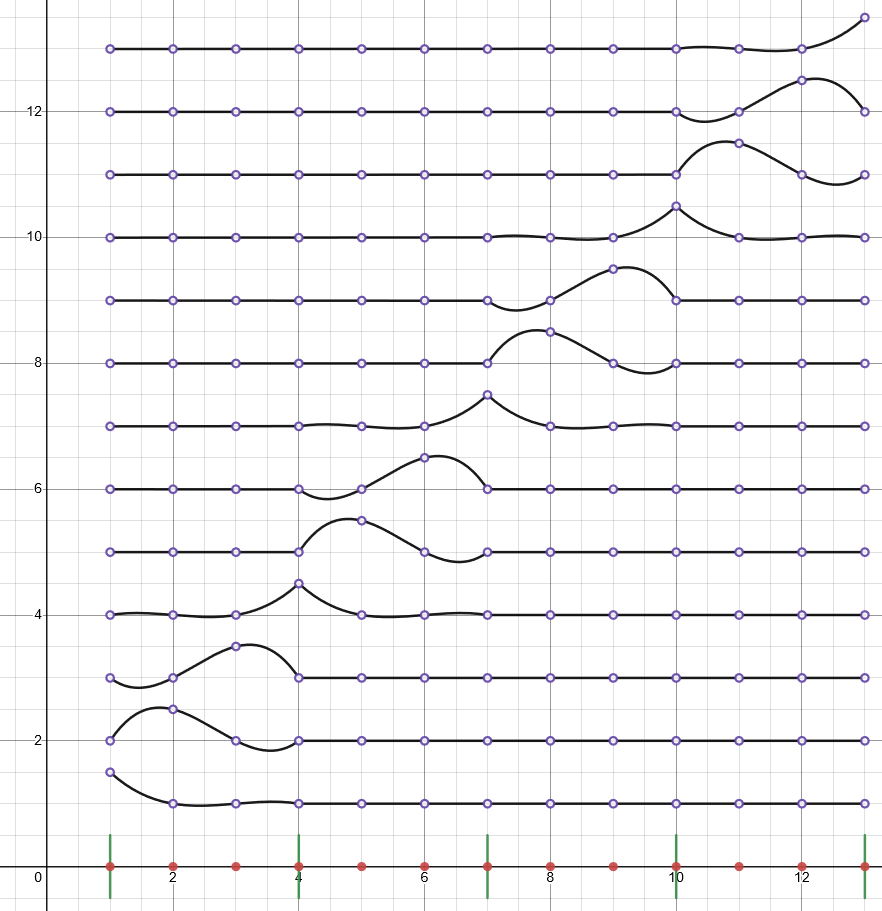
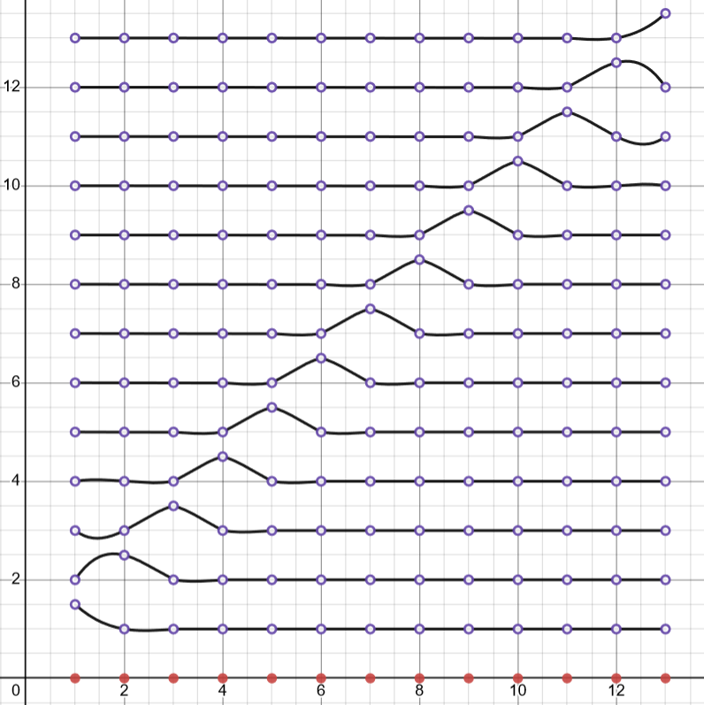

# `boundary.m`

A handle class that stores information relative to specific sections of the boundary. The domain is split into a [list of boundaries](bem_sim.md#property-boundaries), which are allowed to have different functionalities. This class is abstract, with four core subclasses:

- [Free Surface](#free-surface-boundary)
- [Solid Boundary](#solid-boundary)
- [Vertical Wavemaker](#vertical-wavemaker-boundary)
- [Absorbing Piston](#absorbing-piston-boundary)

### Properties

- [`cond_type`](#property-cond_type) (Abstract)- `'dirichlet'` or `'neumann'`, specifying the type of boundary. This should be set by the subclass, not the user.

- [`update_orders`](bem_sim.md#event-system) (Abstract)- A list of orderings for the [`update_characteristics()`](bem_sim.md#method-update_characteristics) events. For each ordering, [`on_update()`](#method-on_update-abstract) is called once inside the update code.

- [`step_orders`](bem_sim.md#event-system) (Abstract)- A list of orderings for the [`step()`](bem_sim.md#method-step) events. For each ordering, [`on_step()`](#method-on_step-abstract) is called once inside the stepping code.

- [`intersection_CCW`](#property-intersection_ccw) - A struct handling information regarding the intersection between this boundary and the next boundary (counterclockwise from this one).

- [`intersect_CW_link`](#property-intersect_cw_link) - A reference to the adjacent boundary in the clockwise direction.

- [`formulation`](#property-formulation) - A struct handling how this boundary is defined.

- [`boundary_nodes`](#property-boundary_nodes) - A $n \times 2$ array representing positions of each node (for $n$ nodes).

- [`BIE_shape_interp`](#property-bie_shape_interp) - A struct handling the Lagrange interpolation polynomial used for the basis functions $N_j$.

- [`characteristics`](#property-characteristics) - A struct containing numerical data of the boundary, such as the values of $\phi$.

- [`node_count`](#property-node_count) - The number of nodes $n$ in this boundary. Both corners are counted.

- [`parent_sim`](#property-parent_sim) - A reference to the [bem_sim](bem_sim.md) object that has this object as a boundary segment.

- [`regridding`](#property-regridding) - A struct handling information regarding how this node should be regridded.

- [`meta`](#property-meta) - A struct handling boundary-relevant information.

### Methods

- [`init_surface()`](#method-init_surface) - Populates fields in the boundary. Every subclass' constructor should be calling this method.
- [`reassemble_nodes()`](#method-reassemble_nodes) - Sets [`boundary_nodes`](#property-boundary_nodes) according to the formulation.
- [`on_update()`](#method-on_update-abstract) (Abstract) - This method is called by the [event system](bem_sim.md#event-system) at the orderings specified in the `update_orders` property.
- [`on_step()`](#method-on_step-abstract) (Abstract) - This method is called by the [event system](bem_sim.md#event-system) at the orderings specified in the `step_orders` property.

## Property: cond_type

A string representing which boundary condition is used for this object. `cond_type = dirichlet` refers to the Dirichlet boundary condition ($\phi$ given on the boundary). This boundary needs to have `phi` $(\phi)$ defined in [`characteristics`](#property-characteristics) before the order 0 [update event](bem_sim.md#event-system) and `phi_t` $(\phi_t)$ before the order 1 update event.

`cond_type = neumann` refers to the Neumann boundary condition ($\phi_n$ given on the boundary). This boundary needs to have `phi_n` $(\phi_n)$ defined in [`characteristics`](#property-characteristics) before the order 0 [update event](bem_sim.md#event-system) and `phi_tn` $(\phi_{tn})$ before the order 1 update event.

Unfortunately, Robin boundary conditions are not supported right now.

## Property: intersection_CCW

This struct holds information regarding the corner on the counter-clockwise side of this boundary. The relevant fields are

- `CCW_link` - A reference to the neighboring boundary on the counter-clockwise side.
- `resolution` - A string representing how this corner should be resolved. What strategy is used to ensure that the last node on the clockwise side and first node of the counter-clockwise side match?

| `resolution` | Description |
|--------------|-------------|
|`ignore`|No resolution is done. Use this if the nodes on either side do not move at the corner, like with solid boundaries.|
|`midpoint`|Place the corner at the average of either side.|
|`match_CW`|Place the corner at the node of the clockwise side. (Place the counter-clockwise side node on top of the clockwise side node.)|
|`match_CCW`|Place the corner at the node of the counter-clockwise side. (Place the clockwise side node on top of the counter-clockwise side node.)|
|`curve_intersect`|Representing both boundaries as curves, place the corner node at the intersection between the two curves. *This causes some instabilities that have not been resolved, so consider avoiding it.*|

## Property: intersect_CW_link

This is a reference to the boundary object that is on the clockwise side of the current boundary. Particularly, if `s` is a [`bem_sim`](bem_sim.md) object, and this boundary is `s.`[`boundaries`](bem_sim.md#property-boundaries)`{i}`, then `intersect_CW_link = s.boundaries{i-1}` if `i > 1` and `s.boundaries{end}` otherwise.

If a reference to the counterclockwise side is desired, use
[`intersection_CCW`](#property-intersection_ccw)`.CCW_link`.

## Property: formulation

This struct has the following fields

- `type` - How the nodes are set. While `"nodes"`, `"implicit"`, and `"parameterized"` are all accepted values at construction, it is best to stick to `"nodes"`. `"nodes"` means that the boundaries are explicitly defined by the given discrete set of nodes. `"implicit"` means that the boundary is defined by an implicit equation $f(x,z) = 0$, where $f$ is specified in `surface_defn`. `"parameterized"` means that the boundary is defined by a parametric equation $\vec r(t)$, where $r$ is specified in `surface_defn`.
- `surface_defn` - A function handle, or `"none"`, depending on `type`.
- `func_interp_rule` - A string representing the [interpolation scheme](#interpolation) for how the shape/basis functions are set. The options are [`"sliding"`](#interpolation-sliding-segments) or [`"sequential"`](#interpolation-sequential-segments).
- `bdry_interp_rule` - A string representing the [interpolation scheme](#interpolation) for how the shape/basis functions are set. The options are [`"sliding"`](#interpolation-sliding-segments), [`"sequential"`](#interpolation-sequential-segments), or `"spline"`.
- `bdry_interp` - An [interpolation](#interpolation) struct representing the Lagrange interpolation polynomials used to interpolate the boundary curve. This is defined when `bdry_interp_rule` is `"sliding"` or `"sequential"`.
- `param_CW` and `param_CCW` - Defined when `type = "parameterized"`, containing the parameters for the first and last nodes respectively. The clockwise corner node should be $\vec r(\verb+param_CW+)$, and the counter-clockwise corner node should be $\vec r(\verb+param_CCW+)$.

## Property: boundary_nodes

This is a $\verb+node_count+\times 2$ array, where `boundary_nodes(i,1)` is the x-position of the ith node, and `boundary_nodes(i,2)` is the z-position of the ith node.

## Property: BIE_shape_interp

An [interpolation](#interpolation) struct representing the Lagrange interpolation polynomials used to generate the shape/basis functions $N_j$ on this boundary.
## Property: characteristics

A struct containing numerical data of the boundary. This is utilized in the BEM to store boundary values used to generate the matrix equation (see [`cond_type`](#property-cond_type)). After the BEM is solved, the solution is placed in `characteristics`, so that after the first pass, both `phi` and `phi_n` are defined. After the second pass, both `phi_t` and `phi_tn` are defined inside `characteristics`.

If [`meta`](#property-meta)`.cfl_contribute` is true, then `dxmin` and `umax` are expected to be defined. `dxmin` specifies the characteristic mesh size of this boundary, while `umax` represents the largest speed on this boundary.

The [free surface boundary](#free-surface-boundary) places more values inside `characteristics`. Namely, the derivatives calculated in the update events are placed here.

Additionally, arrays `Kn` and `Kd` are set by [`BIE_integ_calc()`](functions.md#bie_integ_calc), where `Kn(l,i)` is the value $K_{n;j,l}$, and `Kd(l,i)` is the value $K_{d;j,l}$, as specified in the [BEM discretization section](bem_method.md#discretization). `l` refers to the index of the node in the array given by [`bem_sim.get_nodelist()`](bem_sim.md#method-get_nodelist), and $j$ is the index of the shape function relevant to node `boundary_nodes(i,:)`.

## Property: node_count

The number of nodes in this boundary. Both corners are counted, so summing `node_count` over every boundary will overcount the number of (unique) nodes by the number of corners. Referencing the [BEM discrete formulation](bem_method.md#discretization), this sum is equal to $J$, while the sum minus `length(`[`parent_sim`](#property-parent_sim)`.`[`boundaries`](bem_sim.md#property-boundaries)`)` is $|X|$.

## Property: parent_sim

A reference to the [`bem_sim`](bem_sim.md) object that has this object as a boundary.

## Property: regridding

A struct that holds all the information needed for regridding the boundary. This structure is examined by [`bdry_handle_regrid()`](functions.md#bdry_handle_regrid) in order to figure out how to regrid.

## Property: meta

A struct handling boundary-relevant information.

`cfl_contribute` is used inside [`bem_sim.step()`](bem_sim.md#method-step) when calculating the courant number (or fixing to it). If `cfl_contribute` is both defined *and* set to a true value, then `dxmin` and `umax` from [`characteristics`](#property-characteristics) are both used. The Courant number is
$$C = u\frac{\Delta t}{\Delta x}$$
where $u$ is a speed, $\Delta t$ is the characteristic time step, and $\Delta x$ is the characteristic mesh size. Since the CFL condition places an upper bound on $C$ for which a model is stable, we can overestimate $C$ and bound that, by taking

$$C \le \max(u)\frac{\Delta t}{\min(\Delta x)}$$

Obtaining $\max(u)$ and $\min(\Delta x)$ is based on the largest and smallest values of `umax` and `dxmin`, respectively.

## Method: init_surface()
`boundary.init_surface(varargin)`

Populates fields in the boundary. Every subclass' constructor should be calling this method. Optional arguments (`varargin`) can be as follows:
| Name | Type | Default | Description |
|------|------|---------|-------------|
|`bd_type`| `"nodes"`, `"implicit"`, or `"parameterized"`| `"nodes"` |How the nodes are set. This argument sets [`formulation`](#property-formulation)`.type`. As noted there, only `"nodes"` is currently supported. |
|`node_count`|integer| 2| The number of nodes that this boundary should have. This does nothing if `bd_type == "nodes"`.|
|`surface_nodes`|$n\times 2$ float array or `none`|`none`| If this is not `none`, and `bd_type == "nodes"`, the [`boundary_nodes`](#property-boundary_nodes) array is set to this value.|
|`surface_defn`|function handle or `none`|`none`| The function used to define the surface, dependent on `bd_type`. For `"nodes"`, this is ignored. For `"implicit"`, this is the function for which the boundary is the solution to $f(x,z) = 0$, and for `"parameterized"`, this is parametric equation $\vec r(t)$, from 0 to 1, describing the boundary. |
|`BIE_interp_order`| integer | 1 | The [interpolation](#interpolation) order `M` used in the shape/basis functions $N_j$.|
|`bdry_interp_order`| integer | 1 | The order `M` used in the boundary [interpolation](#interpolation). This is not used if the `"spline"` rule is used in `bdry_interp_rule`.|
|`func_interp_rule`|`"sliding"` or `"sequential"`| `"sequential"`| The interpolation rule used for the shape/basis functions $N_j$. These are explained in the [interpolation section](#interpolation).|
|`bdry_interp_rule`|`"spline"`, `"sliding"`, or `"sequential"`| `"sliding"` | The rule used for boundary interpolation. The last two are explained in the [interpolation section](#interpolation).|

No return value is expected.

## Method: reassemble_nodes()
`boundary.reassemble_nodes()`

Sets [`boundary_nodes`](#property-boundary_nodes) according to the formulation. If [`formulation`](#property-formulation)`.type` is `"nodes"`, this does nothing. If it is `"parameterized"`, then `boundary_nodes` is set as a [`node_count`](#property-node_count)` x 2` array, based on sampling [`formulation`](#property-formulation)`.surface_defn`. An error is thrown if `type == "implicit"`.

No return value is expected.

## Method: on_update() (Abstract)
`boundary.on_update(order)`

This method is called by the [event system](bem_sim.md#event-system) at the orderings specified in the `update_orders` property. To deal with the case that `update_orders` has multiple elements, `on_update` provides the current order, so that conditional branching is used to separate the different passes.

No return value is expected.

## Method: on_step() (Abstract)
`boundary.on_step(dt, order)`

This method is called by the [event system](bem_sim.md#event-system) at the orderings specified in the `step_orders` property. To deal with the case that `step_orders` has multiple elements, `on_step` provides the current order, so that conditional branching is used to separate the different passes.

`dt` is the step size that should be taken.

No return value is expected.

# Free Surface Boundary
(Boundary conditon: `dirichlet`)

Represents the water's surface, which moves over time. This is the medium for waves, since flow is incompressible. To describe this movement, Lagrangian (material) derivatives are calculated from the BEM in order to advect the surface. A second order Taylor series expansion is used.

### update events:

| Event Order | Event |
|-------|-------|
| -1 | Ensure $\phi$ is defined on the free surface by setting it to zero if it isn't. |
| 0.5 | Takes the solution $\phi_n = \frac{\partial \phi}{\partial n}$ from the first BEM pass, along with $\phi$, to calculate derivatives $\phi_s,\phi_{ns}, \phi_{ss}, \phi_t$ and material derivatives $\frac{D\phi}{Dt},\frac{Dx}{Dt},\frac{Dz}{Dt}$. $\phi_t$ is used in the second BEM pass at order 1. The $s$-derivatives describe the direction derivative along the tangent of the surface, while $n$ describes the direction perpendicular to the surface, and $t$ describes the time derivative in an Eulerian sense.|
|1.5 | Takes the solution $\phi_{tn}$ from the second BEM pass, along with $\phi_t$, to calculate derivative $\phi_{ts}$ and second order material derivatives $\frac{D^2\phi}{Dt^2},\frac{D^2 x}{Dt^2},\frac{D^2 z}{Dt^2}$. These additionally require a function $\beta$ describing the angle the surface takes, which is calculated (with along-surface derivative $\beta_s$) in this event.|

### step events:

| Event Order | Event |
|-------|-------|
| 0 | Steps the surface using a second order Taylor expansion. Material derivatives calculated in `update_characteristics()` are used to update $\phi$, $x$, and $z$ values of the nodes of the free surface. |

# Solid Boundary
(Boundary conditon: `neumann`)

Represents a solid wall or barrier. Since this is an irrotational, inviscid model, no-slip conditions are impossible. This boundary enforces only the free slip conditon $\phi_n = \frac{\partial \phi}{\partial n} = 0$.

### update events:

| Event Order | Event |
|-------|-------|
| -1 | Sets $\phi_n$ and $\phi_{tn}$ to be zeros.|

# Vertical Wavemaker Boundary
(Boundary conditon: `neumann`)

Represents a wavemaker that fixes inflow/outflow by setting
$\phi_{n}$ according to a known function, set as the handle `func_u`. In addition, a function `func_D` is used to ramp up the function `u`. The wavemaker is forced to be vertical by fixing the x-positions of all nodes to be the same as the x-position of the free-surface corner node. Because of this, $\phi_n$ is the horizontal velocity, times $\pm 1$, dependent on the direction of the surface normal. This factor is given in `wavedir`,
which is found automatically. This follows the technique of Grilli et al (1997).

### Properties

| Variable | Type | Description |
|-------|-------|----------------|
| `func_u` | function handle | A function $u(t,x,z)$ specifying horizontal velocity. |
| `func_D` | function handle | A function $D(t)$ specifying the ramp function. This should start at 0, and slowly ramp up to 1 over time. One example would be a logistic curve, such as $D(t) = (1+ e^{-t})^{-1}$.|
| `wavedir` | float | The multiplication factor that relates $u$ and $\phi_n$, or equivalently, 1 if the normal points in the +x direction, and -1 otherwise. This takes the value `NaN` by default, which is then set to $\pm 1$ according to the side the free surface appears on at update. If a free surface appears on the counter-clockwise side, `wavedir` is set to 1. If a free surface appears on the clockwise side, `wavedir` is set to -1. This is consistent with expectation, under the assumption that the free surface is at the top, and the wavemaker is set along the entire water column (beneath the free surface). `wavedir` can be manually overwritten, since the setting of `wavedir` within the update code occurs under the condition that it is set to `NaN`.|

### update events:

| Event Order | Event |
|-------|-------|
| -1 | Sets `wavedir` if it is `NaN` (see the property definition). Fixes $\phi_n = \verb+wavedir+ \cdot D(t)u(t,x,z)$ and $\phi_{nt} = \verb+wavedir+\left(\frac{dD}{dt} u + D\frac{du}{dt}\right)$, where the time derivatives are estimated using central finite differences $\frac{df}{dt} = \frac{f(t+\varepsilon) - f(t-\varepsilon)}{2\varepsilon}$.|

### step events:

| Event Order | Event |
|-------|-------|
| 0.1 | Fixes all of the x values of [`boundary_nodes`](#property-boundary_nodes) to the value expected on the free surface. If the free surface is on the clockwise side, x is set to the x-position of the last free surface node (the node at the corner clockwise to the wavemaker). If the free surface is on the counter-clockwise side, x is set to the x-position of the first free surface node (the node at the corner counter-clockwise to the wavemaker). Additionally, if `wavedir` is `NaN`, it is set here, according to the same logic as in the update event. |

# Absorbing Piston Boundary
(Boundary conditon: `neumann`)

Represents a boundary that attempts to absorb incoming waves by serving as a piston that moves left and right according to dynamic pressure, where the piston is always treated as a vertical boundary. This follows the technique of Grilli et al (1997). The hydrodynamic force is
$$F_d = \int p_d ~dz$$
where the integral is taken on the absorbing piston, and $p_D = - \rho\frac{d\phi}{dt}$ is the linearized dynamic pressure. The horizontal velocity of the piston is around $u = \frac{F_d}{\rho h\sqrt{gh}}$. $\rho$ is the density of the fluid (which is not needed, since it cancels with density in $p_D$), $g$ is the gravitational force, taken from [`bem_sim.meta`](bem_sim.md#property-meta)`.g`, and $h$ is the water depth at the absorbing piston. If not set (is `NaN`), this is initialized as the length of the absorbing piston on the first update event. Instead of $u$ set being as above, it is set as the average between $\frac{F_d}{\rho h\sqrt{gh}}$ and the value $u$ from the previous time step. The neumann boundary condition is a solid boundary condition of a moving wall. That is, $\phi_x = \frac{\partial\phi}{\partial x} = u$.

### Properties

| Variable | Type | Description |
|-------|-------|----------------|
| `h` | float | The still water depth at the absorbing piston. This can be set manually, or it will be automatically initialized as the length of the boundary on the first update event. |
| `u_upd` | float | Estimate of $u$, calculated in the first update event. |
| `du_upd` | float | Backwards finite difference estimate of $\frac{\partial u}{\partial t}, calculated in the first update event using `u_upd` calculated in the same call and `u_prev`.|
|`phit_upd`| float array | Estimate of $\phi_t$ for each node, calculated using Euler's method in the step event. Since $\phi_t$ is used in the first update event to calculate dynamic pressure, this estimate is used before the second BEM pass calculates a better $\phi_t$ value.|
|`u_prev`| float | The calculated `u_upd` value from the previous time step. This is set in the step event.|
|`phit_prev`| float array | The BEM-calculated value of $\phi_t$ from the previous time step. This is set in the step event.|
|`z_prev`| float | z-positions of nodes when `phit_prev` was set. This allows for vertical regridding, so that when `phit_prev` is sampled at points that do not line up vertically, interpolation can be used.|
|`t_prev`| float | The time of the simulation corresponding to the `_prev` variables. |
|`normdir`| float | Direction of the surface normal. If normal points in the +x direction, then this is 1. Otherwise, it is -1. This is calculated in the update events. |

### update events:

| Event Order | Event |
|-------|-------|
| -0.5 | Calculates the hydrodynamic force and $u$. Sets $\phi_n$ for the first BEM pass. Sets the value of $Du/Dt$ by finite difference. |
| 0.5 | Sets $\phi_{tn} = \verb+normdir+\cdot(\frac{Du}{Dt} - u\phi_{ss})$ for the second BEM pass. The value of $\phi_{ss}$ is calculated here, but not put into [`characteristics`](#property-characteristics).|

### step events:

| Event Order | Event |
|-------|-------|
| 0.1 | Fixes all of the x values of [`boundary_nodes`](#property-boundary_nodes) to the value expected on the free surface. If the free surface is on the clockwise side, x is set to the x-position of the last free surface node (the node at the corner clockwise to the wavemaker). If the free surface is on the counter-clockwise side, x is set to the x-position of the first free surface node (the node at the corner counter-clockwise to the wavemaker). Sets `phit_upd`, `phit_prev`, `z_prev`, and `t_prev`. |

# Interpolation

Aside from the ability to use splines to interpolate the boundary curve, we use Lagrange interpolation polynomials.
To store these polynomials, a struct is used, which is constructed in [`get_interpolation_struct()`](functions.md#get_interpolation_struct) function. Which nodes are interpolated between at any given point along the boundary is determined by the interpolation rules set in [`formulation`](#property-formulation).

## Interpolation: Sequential segments

In order to use the `"sequential"` rule, [`node_count`](#property-node_count) must be congruent to 1 modulo `M`. That is, there must be an integer $k$ such that $\verb+node_count+ + 1 = k\verb+M+$. `"sequential"` is the standard finite element approach, breaking down the boundary into segments of length `M` (`M+1` nodes). Each segment has the standard way of interpolating its `M+1` nodes, and the value of the shape function $N_j$ depends only on how node $j$ interacts with the segment.

In other words, let $L_p(x)$ be the Lagrange polynomial such that $L_p(q) = \delta_{p,q}$ for $0 \le p,q \le \verb+M+$.
On segment $i$ (nodes $a_i = (i-1)\verb+M+ + 1$ to $b_i = i\verb+M+ + 1$), we have
$$N_j(x) = \left\{\begin{array}{ll}
L_{j - a_i}(x-a_i) & \text{if } a_i \le j \le b_i\\
0 & \text{otherwise}
\end{array}\right.$$

The following is an example of the shape functions $N_j$ over segments $i=1,\dots,4$ using an order `M=3` interpolation.

<!---https://www.desmos.com/calculator/k8kwuhbid3--->

One downside of this strategy is that adjacent nodes are treated very differently in the interpolation. Ideally, how a change to one node affects the curve should be consistent with other nodes. The strategy below helps fix that, as well as minimize errors due to Runge's phenomenon.
## Interpolation: Sliding segments

The `"sliding"` rule separates the boundary into single-length segments. Between node $i$ and $i+1$, we interpolate between a set of nodes that would place the segment in the center. This would ideally be nodes $a_i = i - \lfloor \verb+M+/2\rfloor$ to $b_i = a_i + \verb+M+$, but segments at the start and end would be sampling out-of-bounds nodes. To fix this, we force $1 \le a_i \le \verb+node_count+ - \verb+M+$.
Then, for $i \le x \le i+1$, we have the same formula as with the sequential segments:
$$N_j(x) = \left\{\begin{array}{ll}
L_{j - a_i}(x-a_i) & \text{if } a_i \le j \le b_i\\
0 & \text{otherwise}
\end{array}\right.$$

<!---cit. Grilli 1997--->