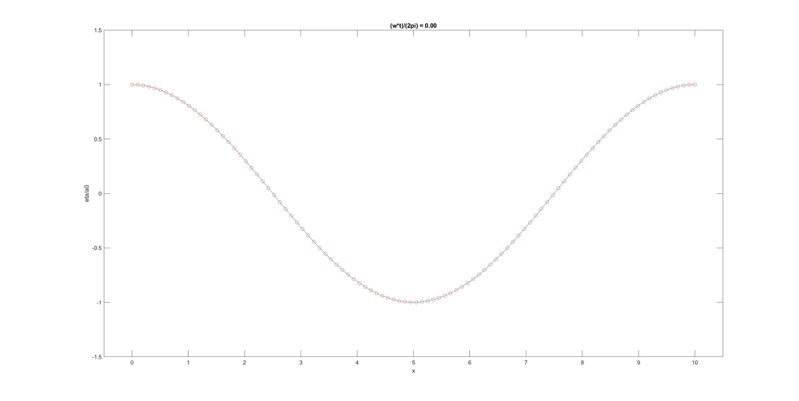
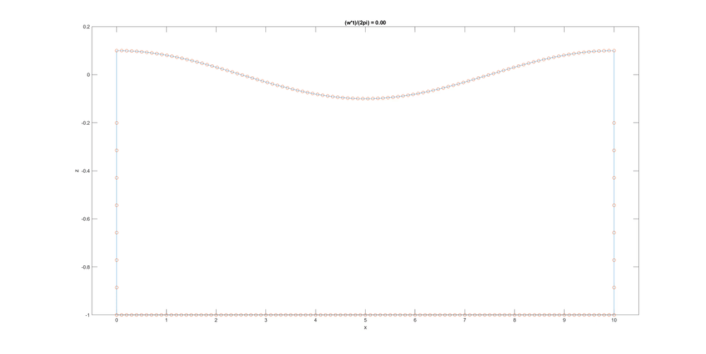
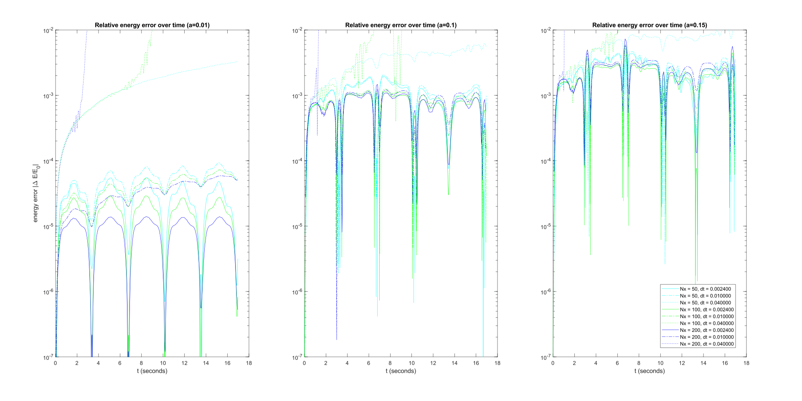
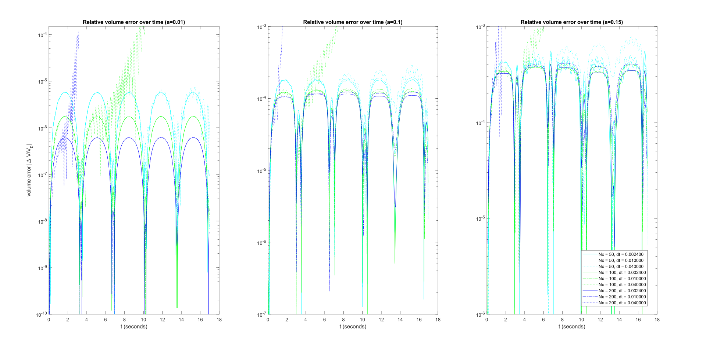
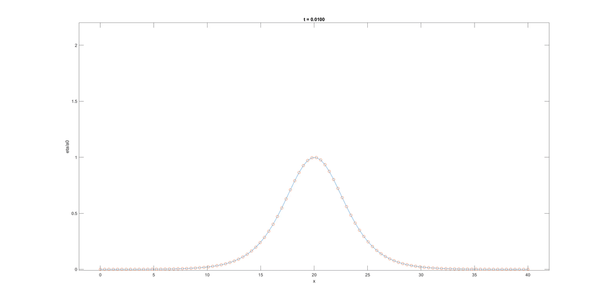
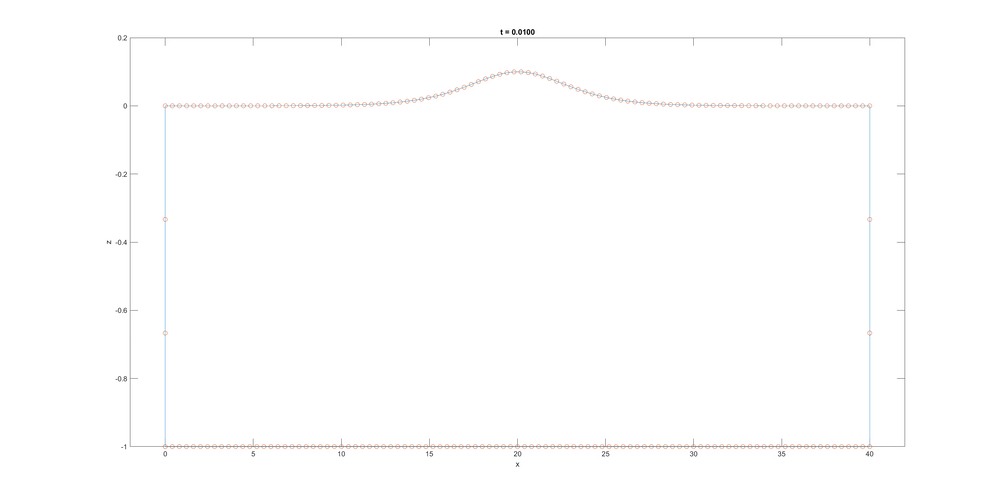
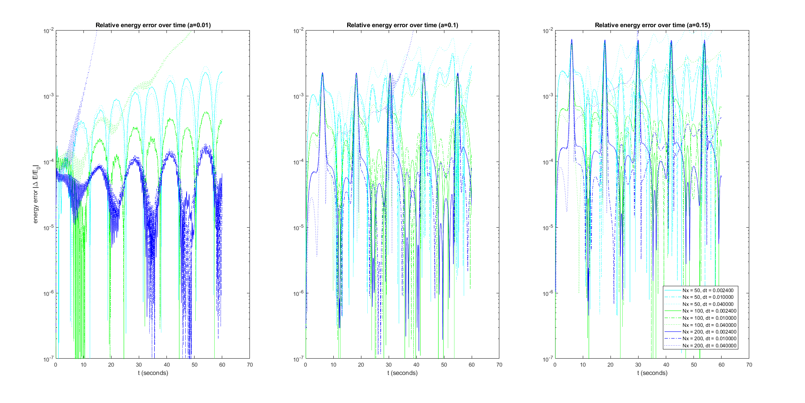
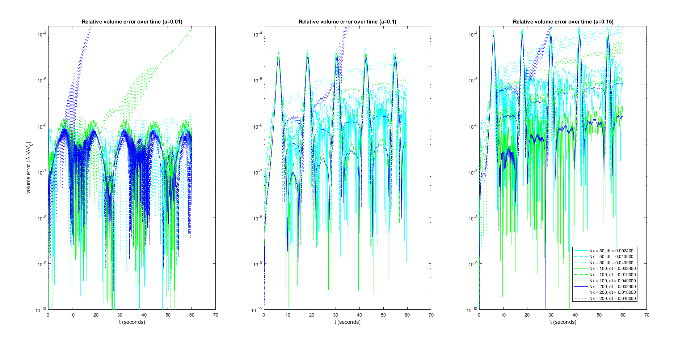

= Examples
Kentaro Hanson
:stem:

The following documents the code in the `examples` directory.

[#standingwave]
== Standing Wave
[source,matlab]
----
figure(1)
gather_run_standingwave(100,0.01,0.1,4,"do_gui",1);
----

 

The wave starts as a second mode (full period) standing wave on a rectangular pool of length stem:[L] and depth 1. For small stem:[a_0], the standing wave solution is accurate. This function also allows for diagonal boundaries by offsetting the bottom right corner.

[stem]
====
\[z = a_0\cos\left(\frac{2\pi}{L}x\right)\]
\[\phi = 0\]
====

The following error plots are obtained for stem:[a_0 = a]:

_Nx_ represents the number of free surface nodes. This run can be performed using `gather_run_standingwave()`:

[#function_gather_run_standingwave]
=== gather_run_standingwave()
[source,matlab]
----
[run_time, sim] = gather_run_standingwave(Nx,dt,a0,T);
----

Initializes and performs a standing wave simulation.

.gather_run_standingwave positional arguments
|===
|Argument |Type |Description
|Nx
|positive integer
|Number of nodes along the free surface

|dt
|positive floating point number
|The time step size of the simulation

|a0
|positive float
|Amplitude of the initial condition cosine wave

|T
|positive float
|number of periods to perform, where a period is defined by the linear approximation
stem:[\frac{2 \pi}{\sqrt{gk \tanh(kh)}}], where stem:[k = \frac{2\pi}{L}],
|===

Optional arguments can also be appended to the argument list, which is handled using `inputParser`.

.gather_run_standingwave optional arguments
|===
|Argument |Type |Default |Description
|do_gui
|logical value
|0
|Whether or not to draw to figure 1 every time step.

|save_plot
|logical value
|0
|Whether or not to save plots to the figure directory. Saving only occurs when `do_gui` is true.

|data_filename
|string or character array
|'null'
|netCDF file to save the simulation data to. When 'null', no saving is done.

|rebalance_walls
|logical value
|0
|After every time step, whether or not to shift the spacing of the walls so that the distances between adjacent wall nodes are equal.

|br_x
|float
|'default'
|x-coordinate of the bottom right double-node. If set, rebalance_walls is forced true. Otherwise, the value 'default' sets `br_x` so that the right wall is vertical.

|br_z
|float
|'default'
|z-coordinate of the bottom right double-node. If set, rebalance_walls is forced true. Otherwise, the value 'default' sets `br_z` so that the bottom boundary (bathymetry) is flat.

|workers
|nonnegative integer
|4
|Number of workers in the thread pool to use. This is given to the value link:bem_sim.html#meta_sim_parallel_workers[`bem_sim.meta.sim_parallel_workers`]

|plot_full
|logical value
|0
|When set to true, the full boundary is plotted instead of just the free surface. This is done by calling link:bem_sim.html#method_plot_full[`bem_sim.plot_full()`] instead of link:bem_sim.html#method_plot_FS[`bem_sim.plot_FS()`]. (When 0, `plot_FS()` is called.)

|wall_resolution_factor
|positive float
|1
|The number of wall nodes are increased (roughly) by this factor. The number of nodes are kept to be 1 mod link:bem_sim.html#interpolation[`M`].

|sim_args
|cell array
|{} (empty array)
|A list of arguments to pass into the link:bem_sim.html#method_constructor[`bem_sim` constructor] on initialization.
|===

[#bouncingsoliton]
== Bouncing Solitary Wave
[source,matlab]
----
figure(1)
gather_run_bouncingsoliton(100,0.01,0.1,40,"do_gui",1);
----

 

The wave starts off using a soliton, placed in the middle stem:[\left(x_0 = L/2\right)] of a rectangular pool of length stem:[L] and depth stem:[h].

_Nx_ represents the number of free surface nodes. This run can be performed using `gather_run_bouncingsoliton()`:

[#function_gather_run_bouncingsoliton]
=== gather_run_bouncingsoliton()
[source,matlab]
----
[run_time, sim] = gather_run_bouncingsoliton(Nx,dt,a0,T);
----

Initializes and performs a standing wave simulation.

.gather_run_bouncingsoliton positional arguments
|===
|Argument |Type |Description
|Nx
|positive integer
|Number of nodes along the free surface

|dt
|positive floating point number
|The time step size of the simulation

|a0
|positive float
|Amplitude of the initial condition cosine wave

|T
|positive float
|length of time to perform. This uses the same units as in `dt`.
|===

Optional arguments can also be appended to the argument list, which is handled using `inputParser`.

.gather_run_bouncingsoliton optional arguments
|===
|Argument |Type |Default |Description
|do_gui
|logical value
|0
|Whether or not to draw to figure 1 every time step.

|save_plot
|logical value
|0
|Whether or not to save plots to the figure directory. Saving only occurs when `do_gui` is true.

|data_filename
|string or character array
|'null'
|netCDF file to save the simulation data to. When 'null', no saving is done.

|rebalance_walls
|logical value
|0
|After every time step, whether or not to shift the spacing of the walls so that the distances between adjacent wall nodes are equal.

|workers
|nonnegative integer
|4
|Number of workers in the thread pool to use. This is given to the value link:bem_sim.html#meta_sim_parallel_workers[`bem_sim.meta.sim_parallel_workers`]

|plot_full
|logical value
|0
|When set to true, the full boundary is plotted instead of just the free surface. This is done by calling link:bem_sim.html#method_plot_full[`bem_sim.plot_full()`] instead of link:bem_sim.html#method_plot_FS[`bem_sim.plot_FS()`]. (When 0, `plot_FS()` is called.)

|wall_resolution_factor
|positive float
|1
|The number of wall nodes are increased (roughly) by this factor. The number of nodes are kept to be 1 mod link:bem_sim.html#interpolation[`M`].

|br_x
|float
|'default'
|x-coordinate of the bottom right double-node. If set, rebalance_walls is forced true. Otherwise, the value 'default' sets `br_x` so that the right wall is vertical.

|br_z
|float
|'default'
|z-coordinate of the bottom right double-node. If set, rebalance_walls is forced true. Otherwise, the value 'default' sets `br_z` so that the bottom boundary (bathymetry) is flat.

|L
|positive float
|40
|Length of the simulation in the x-direction. This is the distance between the left and right walls at stem:[z=0].

|sim_args
|cell array
|{} (empty array)
|A list of arguments to pass into the link:bem_sim.html#method_constructor[`bem_sim` constructor] on initialization.
|===

[#surftank]
== Surf Tank Solitary Wave
[source,matlab]
----
figure(1)
gather_run_surftank(400,1,9,'null',0,'do_plot_figs',1)
----
The wave starts off using a soliton, placed in a pool to induce shoaling.

[#function_gather_run_surftank]
=== gather_run_surftank()
[source,matlab]
----
gather_run_surftank(Nx,courant_target,tmax,ncfile,do_log);
----

Initializes and performs a standing wave simulation.

.gather_run_surftank positional arguments
|===
|Argument |Type |Description
|Nx
|positive integer
|Number of nodes along the free surface

|courant_target
|positive floating point number
|The desired Courant number to determine the time step size of the simulation

|tmax
|positive float
|when to stop the simulation

|ncfile
|string or character array
|the file to save the simulation data to. (can be left blank to avoid storing data) If set to "null", then no data is stored

|do_log
|logical value
|whether or not to write to a log file. (can be left blank; defaults to true) If specified, `ncfile` must be given
|===

Optional arguments can also be appended to the argument list, which is handled using `inputParser`. If optional arguments are used, `ncfile` and `do_log` must be specified.

.gather_run_surftank optional arguments
|===
|Argument |Type |Default |Description
|load_from_nc
|string
|'no'
|the netcdf file to load a simulation from (good for restoring lost sessions). Set to 'no' to use the surf tank initial condition.

|load_from_nc_t
|float
|0
|If `load_from_nc` is set, this is the time in the netCDF file that is loaded and used.

|sim_setup_handle
|function handle (bem_sim) -> (bem_sim)
|@(x) x
|a function handle that modifies a generated bem_sim object prior to running, in order to set certain parameters.

|log_filename
|string or character array or 0
|0
|The name of the log file if `do_log` is set. When 0, the default name, "surftanksimlog__YYYY_MM_DD.txt", is used, where the date is inserted at the end.

|loop_callback
|function handle (bem_sim) -> (bem_sim)
|@(x) x
|a function handle that modifies a generated bem_sim object after each time step.

|append_nc_callback
|function handle (float: prior_saved_time, float: current_time, int: steps_since_save) -> (logical)
|@(tl,t,s) 1
|function relating to run_sim should_append_nc, which allows the user to specify when saving to the netCDF file should be done.

|do_plot_figs
|logical
|0
|whether or not figures should be plotted over time.

|do_save_figs
|logical
|0
|whether or not plotted figures should be saved (if `do_plot_figs` is set).
|===

//[bibliography]
//== References
