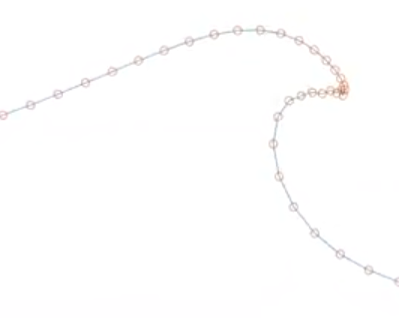

# Surface Regridding Theory

Within the [discretization](bem_method.md#discretization), there are two main sources of error:

- Approximation of $\phi$ and $\frac{\partial\phi}{\partial n}$ when projecting onto the basis functions.
- Approximation of the boundary itself. The way the BEM sees the boundary is different from how the stepping sees the boundary, since the interpolation schemes are different. Discussions around boundary-dependent derivatives $(\phi_s,\phi_n,\phi_{ss},\dots)$ are especially difficult when the BEM uses linear approximations. These values are instead computed using sliding elements. So, errors are not generated by just the boundary discretization, but also by the disagreements between interpolations.

We will avoid discussion of errors generated by quadrature, here, though it may be of note that if such errors are not handled well, [nodes getting too close](#node-proximity) may become a bigger problem.

Ideally, we would space the nodes $X$ in order to minimize this error, but this project does not take this strategy, as discussions of a posteriori estimates are very complicated. Instead, we discuss desirable spacing according to certain heuristics.

## Node Proximity

It is easy to see that if nodes are too far apart, it becomes more difficult to approximate the potential $\phi$ and boundary $\Gamma$, but there is also a problem when nodes get too close together, since different interpolations are used between the BEM code and stepping code. If nodes get close together, features like curvature and normal vectors may have more drastic differences. Since the nodes describe fluid in a Lagrangian sense (at least, on the free surface), errors generated by these disagreements may grow significantly over time.

Ultimately, we need to strike a delicate balance between keeping nodes close enough to be a sufficient approximation, while keeping them far enough apart so that the simulation does not blow up.

## Regridding Heuristics

One could avoid bad spacing by simply regridding the nodes to be evenly spaced along the domain, but to have a high enough resolution for the simulation to be meaningfull, we may then need to use far more nodes than necessary.
In this project, we focus nodes on regions we consider important -- we would rather concentrate nodes around regions of activity, as opposed to still water. To do this, we space the nodes evenly along a "weighed" length:

$$L = \int ~d\Gamma,~~~~~\tilde L = \int f(\vec x)~d\Gamma$$

where $f$ is some positive function. In regions where $f$ is large, we would have $\tilde L > L$, so the distance between nodes is perceived as greater than they actually are. This means that evenly spacing nodes according to $\tilde L$ using a function like
$$f(\vec x) = 1 + |\nabla \phi(\vec x)|$$
will have the affect of concentrating more nodes around places where $|\nabla\phi|$ is greater (where fluid speed is greater).
<!---Similar to normu, link it, and mention how what we have here may have problems with units--->

This concentration effect occurs without compromising the ability to keep nodes from getting too close. If two nodes are close enough, $f$ can be considered constant between them, so if the distance between them decreases by a factor of two, both the true length $L$ and weighed length $\tilde L$ changes by the same factor.

The choices that can be made in [`bdry_handle_regrid()`](functions.md#bdry_handle_regrid) are explained below.

### Length weight: curve3D

This describes the `"nodeshift"` mode of regridding under `regrid_type`s `"shift_by_curve3d_normu"` and `"shift_by_curve3d_maxphis"`.

For `"shift_by_curve3d_normu"`, the parameterization of the boundary $\vec r(t) = (x(t),z(t))$ and velocity potential $\phi(t)$ is considered a curve in 3D:

$$\vec r_{3d}(t) = \left(x(t), ~~z(t),~~\frac{a}{\max(u)}\phi(t) \right)$$

where $a$ is a nondimensional parameter and $\max(u) = \max\sqrt{\phi_s^2 + \phi_n^2}$. The length is calculated as
$$\tilde L = \int |\vec r_{3d}'(t)|~dt$$
$$=\int \sqrt{\frac{x'(t)^2 + z'(t)^2 + \left(\frac{a}{\max(u)}\phi'(t)\right)^2}{x'(t)^2 + z'(t)^2}}~d\Gamma$$
$$=\int \sqrt{1 + \left(\frac{a}{\max(u)}\phi_s(t)\right)^2}~d\Gamma$$

This is because $d\Gamma= |r'(t)|dt =\sqrt{x'(t)^2 + z'(t)^2}~dt$, and $\phi'(t) = \phi_s(t)|\vec r'(t)|$ (you can see the latter by writing $\phi$ as a function of position, and applying the chain rule to $\phi\circ\vec r$).

`"shift_by_curve3d_maxphis"` instead nondimensionalizes by $\max(\phi_s)$ instead of $\max(u)$. This results in a length
$$\tilde L =\int \sqrt{1 + \left(\frac{a}{\max(\phi_s)}\phi_s(t)\right)^2}~d\Gamma$$

### Length weight: curve2D_normu

This describes the `"nodeshift"` mode of regridding under the `"shift_by_curve2d_normu"` `regrid_type`. Instead of using $\phi_s$ (through $\phi'$), we instead use the full fluid speed:

$$\tilde L =\int \sqrt{1 + \left(\frac{a}{\max |\nabla \phi|}|\nabla \phi|\right)^2}~d\Gamma$$

because $\phi_n$ is used, it is necessary to have [`update_characteristics()`](bem_sim.md#method-update_characteristics) called first. Since nodes are shifted afterwards, `update_characteristics()` needs to be called again.

## Automatic Regridding

When dealing with drasically changing length scales (such as a shoaling waves, where the characteristic length of, say wavelength, is much larger than some chosen characteristic length of the overturn, say lip width), sticking with one spacing may not be feasible.

Additionally, we should not be regridding nodes every time step, since shifting nodes introduces more approximation errors.
In this way, we want to figure out when the current spacing is poor enough to justify (potentially) introducing small errors to avoid future disaster.

To do this, we specify two thresholds: a local threshold $R_l$ and global threshold $R_g$. If $\tilde L_k$ represents the weighed length between nodes $k$ and $k+1$,
we call for the free surface to be regridded when one of the following checks fail:
$$1/R_g < \frac{\tilde L_k}{\text{avg}_j(\tilde L_j)} < R_g~~~~~~~\forall k$$
$$1/R_l < \frac{\tilde L_k}{\tilde L_{k+1}} < R_l ~~~~~~~\forall k$$
That is, every segment between nodes must be within a factor of $R_g$ from the average and a factor of $R_l$ from its neighbors.

## Transition Region

We may want to shift from a given spacing to the regridded spacing over a distance, so that node spacing does not make a drastic change. We can modify the weights (the function $f$) in order to achieve a smooth transition. Integrals are computed by collocating $f$ at nodal points. We want to modify $f$ into $\hat f$ such that

$$\tilde s = \int_1^{2} \hat f~d \Gamma = \int_{N-1}^{N} \hat f~d \Gamma$$

where $\hat f$ and $f$ are parameterized by node index ($f(1)$ is the value at the first node and $f(N)$ is the value at the last node), and $\tilde s = \frac{\hat{\tilde L}}{N-1} = \frac{\int_1^N \hat f~d\Gamma}{N-1}$. We can approximate
$$\tilde s = \hat f(1)\hat L_1 = \hat f(N)\hat L_{N-1}$$
where $\hat L_1, \hat L_N$ are the desired lengths of the first and last segments, respectively.

This gives an implicit equation to solve for $\hat f$, but we can use approximation to make this into an explicit 2x2 system. Some may view the implicit form to not be very expensive, and they are welcome to make a more accurate transition algorithm.

Given a transition region of $r$ nodes, we are looking for values $\hat f_1$ and $\hat f_{N}$ to set
$$\hat f(t) = \left\{\begin{array}{ll}
    \frac{t-r}{r}\hat f_1 + \frac{t}{r}f(t)& \text{ if } t \le r\\
    f(t)& \text{ if } r < t < N-r\\
    \frac{t+r-N}{r}\hat f_{N} + \frac{N-t}{r}f(t) & \text{ otherwise}
\end{array}\right.$$

This means that we can approximate $\tilde s = \frac{\tilde L + \frac{\hat f_1 - f(1)}{2}L_- + \frac{\hat f_{N} - f(N)}{2}L_+}{N-1}$,
where $L_-$ estimates the unweighed length between nodes 1 and $r$, and $L_+$ estimates the unweighed length between nodes $N-r$ and $N$. Then, we have two equations

$$(N-1)\hat L_1\hat f_1 = \tilde L + \frac{\hat f_1 - f(1)}{2}L_- + \frac{\hat f_{N} - f(N)}{2}L_+$$
$$(N-1)\hat L_{N-1}\hat f_N = \tilde L + \frac{\hat f_1 - f(1)}{2}L_- + \frac{\hat f_{N} - f(N)}{2}L_+$$

These equations are solved for $\hat f_1$ and $\hat f_N$, which are then bounded below by [`boundary.regridding`](boundary.md#property-regridding)`.reweight_min`. Then, regridding is done to average out node spacing with respect to the function $\hat f$.
